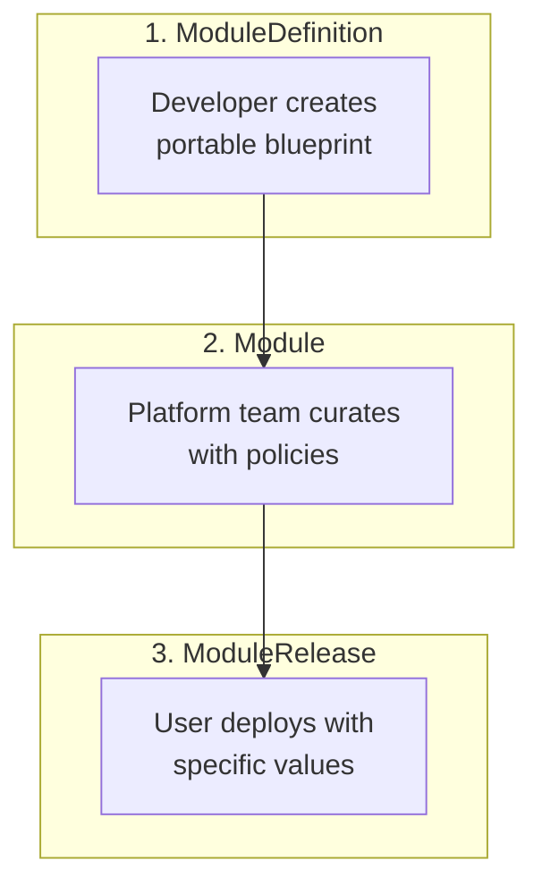

# Open Platform Model (OPM)

> **A cloud-native module architecture that transforms Kubernetes application delivery through element composition, type-safe configurations, and clear separation of concerns**

## Our vision

Open Platform Model envisions a digital commons where applications and infrastructure speak the same composable language, making software truly portable across any provider, any scale, any region - forever breaking the chains of vendor lock-in. By transforming how we describe, collaborate on, distribute, and deploy almost everything, OPM aims to enable sovereign digital ecosystems where federated service providers compete on innovation rather than lock-in, starting with Europe's answer to tech giant monopolies.

## Why OPM?

Modern cloud-native organizations face a fundamental challenge: how to balance developer productivity with platform governance while maintaining application portability. Current solutions force trade-offs:

- **Helm Charts** mix concerns with fragile templating and no built-in policy enforcement
- **Kubernetes manifests** lack abstraction and require platform-specific knowledge
- **Platform-specific tools** create vendor lock-in and limit portability

OPM solves these challenges through:

- **🔒 Type Safety**: CUE-based validation catches errors at compile-time, not runtime
- **🎯 Clear Separation**: Distinct ownership boundaries for developers, platform teams, and users
- **🔄 True Portability**: Modules work across any OPM-compliant platform without modification
- **⚡ Policy as Code**: Built-in scope system for automated policy enforcement
- **🧩 Element Composition**: Everything is an element - compose primitives into powerful abstractions
- **🛡️ Security by Default**: Native OSCAL integration for automated compliance validation

## Core Concepts

### Everything is an Element

OPM's foundational principle: every capability, behavior, and resource is expressed as an element. Like LEGO blocks, primitive elements (Container, Volume, Network) combine into composite elements (Database, WebService), which compose into complete modules.

```cue
// Primitive elements are the building blocks
#Container    // Single-purpose container primitive
#Volume       // Storage primitive
#NetworkPolicy // Network security primitive

// Composite elements combine primitives
#WebService: #Container & #Expose & #Replicas & #HealthCheck
#Database: #Container & #Volume & #Secret & #ConfigMap
```

### Three-Layer Architecture

OPM enforces clear separation of concerns through its layered architecture:



#### 1. ModuleDefinition (Developer Domain)

- Portable application blueprint
- Contains components, scopes, and configurable values
- Platform-agnostic and reusable

#### 2. Module (Platform Domain)

- Curated version with platform policies
- Adds PlatformScopes for governance
- Maintains original developer intent

#### 3. ModuleRelease (User Domain)

- Deployed instance with user overrides
- References Module from catalog
- Targets specific environment

### Components: Building Blocks

Components are element compositions serving two roles:

**Workload Components** - Deployable services:

- `Stateless`: Horizontally scalable services
- `Stateful`: Services with persistent state
- `Daemon`: Node-level services
- `Task`: Run-to-completion jobs
- `ScheduledTask`: Recurring jobs

**Resource Components** - Shared resources:

- ConfigMaps, Secrets, Volumes for other components

### Scopes: Cross-Cutting Concerns

Scopes apply single elements across component groups:

**PlatformScopes (Immutable)**:

- Platform-enforced policies
- Security, compliance, governance
- Cannot be overridden by developers

**ModuleScopes (Mutable)**:

- Developer-controlled optimizations
- Traffic management, observability
- Work within platform constraints

## Quick Example

```cue
// ModuleDefinition - Developer creates
#ModuleDefinition: {
    #metadata: {
        name: "web-app"
        version: "1.0.0"
        workloadType: "stateless"
    }

    components: {
        webServer: {
            #Container      // Core element
            #Expose         // Networking element
            #Replicas       // Scaling element

            container: {
                image: values.image  // User-configurable
                ports: [{containerPort: 8080}]
            }
            replicas: values.replicas
        }
    }

    values: {
        image?: string | *"nginx:1.21"
        replicas?: uint & >=1 & <=10 | *3
    }
}

// Module - Platform adds governance
#Module: {
    #ModuleDefinition  // Inherits all developer content

    scopes: {
        "security-baseline": {
            #PodSecurity
            podSecurity: {
                runAsNonRoot: true
                readOnlyRootFilesystem: true
            }
            appliesTo: "*"  // All components
        }
    }
}

// ModuleRelease - User deploys
#ModuleRelease: {
    module: "web-app:1.0.0"
    values: {
        replicas: 5
        image: "myapp:v2"
    }
}
```

## Key Features

### 🔒 Type Safety with CUE

Unlike template-based solutions, OPM leverages CUE's powerful type system:

```cue
// Strong typing prevents configuration errors
replicas: uint & >=1 & <=100  // Must be 1-100
image: string & =~".+:.+"      // Must include tag
memory: string & =~"^[0-9]+[KMG]i?$"  // Valid memory units
```

### 🎯 Policy Enforcement

Platform teams enforce organizational requirements without breaking portability:

```cue
complianceScope: #PlatformScope & {
    #CompliancePolicy
    compliancePolicy: {
        framework: "PCI-DSS"
        controls: {
            encryption: {atRest: true, inTransit: true}
            auditLogging: {enabled: true, retention: "365d"}
        }
    }
    appliesTo: [paymentService, database]
}
```

### 🧩 Composable Elements

Build complex capabilities from simple primitives:

```cue
// Define once, reuse everywhere
#SecureWebService: #WebService & #TLSPolicy & #RateLimiting & #Monitoring

// Use in components
apiGateway: #SecureWebService & {
    container: {image: "gateway:latest"}
    rateLimiting: {requestsPerSecond: 1000}
}
```

### 🔄 Multi-Platform Support

OPM abstracts over multiple deployment targets:

- **Kubernetes**: Native resource mapping
- **Docker Compose**: Container orchestration
- **Cloud Platforms**: AWS, Azure, GCP
- **Custom Platforms**: Extensible provider system

### 🛡️ Built-in OSCAL Compliance (Work in Progress)

> **Note**: OSCAL integration is currently under development and represents a key future capability of OPM.

OPM will natively integrate NIST's Open Security Controls Assessment Language (OSCAL) for automated compliance validation:

```cue
// PLANNED: Every module will automatically generate OSCAL component definitions
#ModuleDefinition: {
    #metadata: {
        oscal: {
            componentType: "software"
            controlImplementations: [
                {
                    controlId: "AC-2"  // Account Management
                    description: "Module implements RBAC with service accounts"
                },
                {
                    controlId: "SC-8"  // Transmission Confidentiality
                    description: "All traffic encrypted via TLS 1.3"
                }
            ]
        }
    }
}

// PLANNED: Platform scopes will map to OSCAL controls
encryptionScope: #PlatformScope & {
    #EncryptionPolicy
    encryptionPolicy: {
        atRest: "AES-256"
        inTransit: "TLS-1.3"
        oscalControls: ["SC-8", "SC-13", "SC-28"]  // Auto-mapped
    }
}
```

**Planned Benefits of OSCAL Integration:**

- **Continuous Compliance**: Transform manual audits into automated validation
- **Machine-Readable**: Export compliance artifacts in standard OSCAL formats (JSON/YAML/XML)
- **Control Mapping**: Automatic mapping between platform policies and NIST controls
- **Audit Trail**: Every module deployment will include compliance attestation
- **Framework Support**: Planned support for NIST 800-53, FedRAMP, PCI-DSS, SOC2, HIPAA mappings

## OPM Modules vs Helm Charts

| Aspect | Helm Charts | OPM |
|--------|------------|-----|
| **Type Safety** | Runtime errors only | Compile-time validation |
| **Configuration** | YAML templating | CUE with constraints |
| **Policy Enforcement** | External tools required | Built-in scope system |
| **Separation of Concerns** | Monolithic structure | Three-layer architecture |
| **Composability** | Limited subcharts | Full element composition |
| **Platform Independence** | Fork charts for changes | Clean platform additions |
| **Compliance** | Manual validation | Automated OSCAL integration |

## Use Cases

### Enterprise Platform Teams

- Enforce security and compliance policies across all applications
- Provide golden paths for developers without limiting flexibility
- Maintain centralized governance with distributed development

### Cloud-Native Applications

- Build portable applications that run anywhere
- Compose complex architectures from reusable elements
- Manage configuration complexity with type safety

### Multi-Cloud Deployments

- Deploy the same modules across different cloud providers
- Maintain consistency while leveraging platform-specific optimizations
- Avoid vendor lock-in with portable definitions

## Roadmap

### Current Focus

- [ ] Core element library expansion
- [ ] Kubernetes provider implementation
- [ ] Integration of the OSCAL framework
- [ ] A set of opinionated cloud-native applications as a showcase for a base platform
- [ ] Developer tooling and CLI

### Future Plans

- [ ] Workflows: Support some way of describing workflow pipelines in a generalized way
  - Question: Should it be a standard for existing CI/CD pipeline implementations or should it be its own pipeline system?
  - Question: Should it be split into a standard schema for existing pipeline tools and another implemenetation for doing simple pipeline tasks in modules themselvses (e.g. application upgrade/downgrade steps, etc)
- [ ] Cloud provider integrations (AWS, Azure, GCP). MAYBE!
- [ ] Module marketplace based on CUE central registry
- [ ] IDE extensions for CUE/OPM

## Inspiration & Acknowledgments

OPM builds upon the shoulders of giants:

- **[Open Application Model (OAM)](https://oam.dev)** - The foundational specification
- **[CUE Language](https://cuelang.org)** - Powerful configuration language
- **[KubeVela](https://kubevela.io)** - OAM reference implementation
- **[Crossplane](https://crossplane.io)** - Infrastructure composition patterns
- **[Timoni](https://timoni.sh)** - CUE-based package management

## License

Open Platform Model is licensed under the Apache License 2.0. See [LICENSE](LICENSE) for details.

## Security

For security issues, please email <security@opm.dev> instead of using the issue tracker.

---

<div align="center">

**Transform your cloud-native journey with OPM**

[Get Started](docs/getting-started.md) • [Documentation](docs/) • [Examples](examples/) • [Community](https://github.com/open-platform-model/opm/discussions)

</div>
