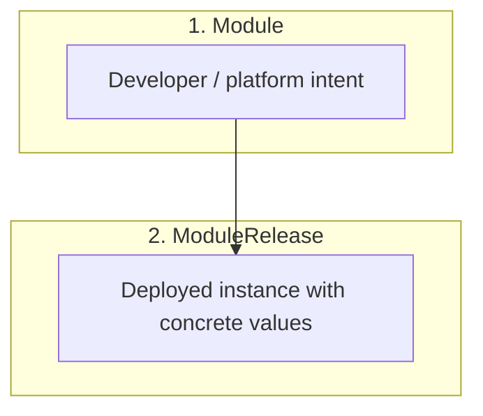

# Open Platform Model (OPM)

**A cloud-native application model that lets platform teams and developers speak the same language — with type safety, portable definitions, composable building blocks, and zero vendor lock-in.**

---

## Vision

Open Platform Model defines a portable, composable way to describe applications and the platform capabilities they rely on. The goal is to let teams build and run software across different infrastructures and providers — including future sovereign providers — without rewriting everything each time.

Instead of:

* teaching every developer the full details of the platform,
* hard-coding vendor specifics into every service,
* or coupling application definitions to specific runtimes,

OPM aims to standardize how applications and their behavior are described.

Long-term, this enables an ecosystem where providers can offer compliant capabilities in a standard format, and customers can assemble portable applications against that format.

---

## Why OPM?

Modern platform teams face the same tension everywhere: Developers want fast delivery. Operations need safety and reliability. Leadership wants portability and control.

Today that usually means:

* Helm charts with string templating and no built-in guardrails
* Raw Kubernetes YAML that leaks every internal detail
* Proprietary vendor tooling that locks you in

OPM takes a different approach:

* **Type safety by default**
  OPM is defined in CUE. Invalid configuration is rejected before deployment, not in production.

* **Clear separation of responsibility**
  Developers declare intent. Platform teams extend definitions. Consumers get approved releases.

* **Composability by design**
  Resources, Traits, and Blueprints are independent building blocks that compose without coupling.

* **Portability by design**
  OPM is not bound to Kubernetes alone. The same definitions can target Kubernetes, Docker Compose, other orchestrators, or future providers that implement the model.

---

## Definition Types

In OPM, everything is a **Definition**.

Each Definition type has a clear job. Together they describe what should run, how it should behave, and how it's delivered.

### Resource

A Resource is the fundamental building block inside a Component. It describes "the thing that actually exists."

A Component must include at least one Resource.

A Resource can represent:

* a workload (`#Container`)
* persistent state / storage (`#Volume`)
* runtime configuration (`#ConfigMap`, `#Secret`)
* other platform-relevant primitives (like network rules)

Examples:

* `#Container` – describes a single container that represents the workload for this Component.
* `#Volume` – describes one or more persistent volumes.
* `#ConfigMap`, `#Secret` – configuration and sensitive inputs.

You can declare multiple Resources in the same Component (for example: one container plus multiple volumes). At least one is required so the Component is about something real.

### Trait

A Trait is an optional behavior and property modifier that applies to a Component.

Traits adjust how a Component runs, scales, exposes itself, and reports health. Traits may relate to specific Resources via `parentResources`, but they modify the Component's overall behavior, not individual Resources.

Examples:

* scaling / replicas
* ingress / exposure rules
* health / readiness / liveness checks
* TLS / transport security posture

You can attach multiple Traits to the same Component. Defaults exist so you don't have to specify every Trait every time.

In plain terms: Resources are "what exists," Traits are "how the Component behaves."

### Blueprint

A Blueprint is a reusable, higher-level definition that bundles Resources and Traits into something humans actually want to deploy.

Blueprints exist so most developers don't have to wire Resources and Traits manually.

Examples:

* `WebService` – a typical stateless HTTP service with container, replicas, health checks, and network exposure already defined.
* `StatefulService` – a stateful workload with container + volume + backup/retention expectations.

Blueprints can be composed from other Blueprints. Platform teams can publish a set of blessed Blueprints as "golden paths" for internal use.

### Component

A Component is what an application developer (or platform engineer acting as an application developer) actually declares in a module.

A Component can be:

* one or more Resources plus Traits, or
* a Blueprint, which already packages Resources + Traits.

In other words: the Component is the "piece of the app" you're describing.

### Lifecycle (planned)

A Lifecycle Definition describes how something changes over time, not just what it looks like at rest.

This includes:

* deployment / rollout strategy
* upgrade sequencing
* backup + restore steps for stateful workloads
* pre-deploy and post-deploy hooks
* safe teardown or migration

Lifecycle Definition is intentionally called out but treated as "future." The goal is to eventually express upgrade/rollback behavior and compliance-critical steps ("backup before upgrade") in the model itself, instead of burying that logic in CI/CD glue.

---

## Components

A **Component** belongs to a Module. It represents one logical part of an application.

A Component is made from:

* one or more Resources (required),
* optional Traits that modify the Component's behavior,
* or a Blueprint (which already bundles Resources and Traits).

There are two broad categories of Components:

### Workload Components

* Stateless: horizontally scalable service
* Stateful: service with persistent data
* Daemon: node-scoped service
* Task: run-to-completion job
* ScheduledTask: recurring / cron-like job

### Resource Components

* Shared or supporting resources like `ConfigMap`, `Secret`, `Volume`, etc., which other Components consume.

This split makes it clear what is "a running thing" vs "infrastructure/config backing that thing."

---

## Delivery Flow

OPM formalizes how something goes from "what I want" to "what actually runs." The flow is expressed in two main objects:



### Module

The portable intent. Created by developers and/or platform engineers.

A Module:

* declares Components,
* wires Resources and Traits (or uses Blueprints),
* defines which values are tunable by the eventual user.

**Developers** write Modules to describe application intent.

**Platform teams** can inherit and extend upstream Modules via CUE unification, adding additional Components or constraints without rewriting the original definition.

### ModuleRelease

The concrete deployment instance.

A ModuleRelease:

* references a specific Module,
* supplies final values (image tag, replica count, etc.),
* targets a specific runtime environment.

This is what actually lands on a runtime.

---

## Type Safety with CUE

OPM is expressed in CUE. CUE gives you structural typing, constraints, validation, and safe merging.

That means:

* You can express allowed ranges and formats.
* You can block invalid combinations at definition time.
* You can guarantee that platform policies aren't silently dropped.

Example:

```cue
replicas: uint & >=1 & <=100
image:    string & =~".+:.+"            // must include a tag
memory:   string & =~"^[0-9]+[KMG]i?$"  // k8s-style resource units
```

The point: mistakes get caught before rollout, not in production.

---

## How OPM Compares to Helm

| Aspect                 | Helm Charts                         | OPM                                                                 |
| ---------------------- | ----------------------------------- | ------------------------------------------------------------------- |
| Type Safety            | Mostly runtime errors               | Compile-time validation with CUE                                    |
| Configuration          | String templating in YAML           | Structured Definitions with constraints                             |
| Separation of Concerns | Single blob owned by whoever yells  | Module → ModuleRelease with clear ownership                         |
| Reuse                  | Subcharts, values files             | Blueprints (Resources + Traits pre-bundled)                         |
| Composability          | Limited, tightly coupled            | Independent building blocks that compose without coupling           |
| Portability            | Usually vendor- or cluster-specific | Same Module, different providers                                    |

---

## Roadmap

### Now

* Define and stabilize the Definition types (Resource, Trait, Blueprint, Component).
* Build a growing library of reusable Blueprints for common workloads.
* Kubernetes provider implementation.
* CLI and developer workflow around Module → ModuleRelease.

### Planned / next

* Lifecycle Definition: rollout / upgrade / backup / migration semantics expressed in the model.
* Governance specification: design a future approach to policy and compliance.
* Provider ecosystem: publishable Modules other orgs can consume.

---

## License

Open Platform Model (OPM) is licensed under Apache License 2.0. See `LICENSE`.

---

**Build sovereign, portable platforms — not just clusters.**
