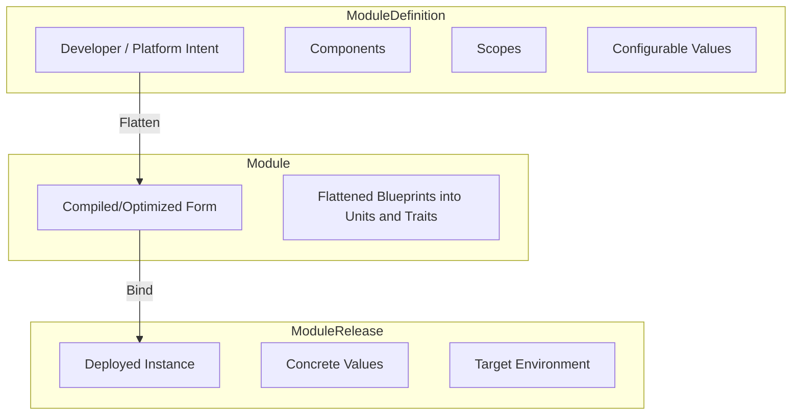
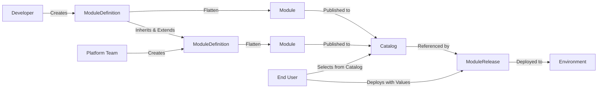

# Open Platform Model (OPM) Architecture Overview

## Introduction

Open Platform Model (OPM) is a cloud-native module architecture that enforces clear separation of concerns between module developers, platform teams, and end users through component composition and deployment hierarchy. OPM enables portable module definitions while maintaining platform control and providing simple deployment experiences.

**OSCAL Integration**: OPM natively integrates OSCAL (Open Security Controls Assessment Language) to provide machine-readable compliance that transforms manual audit processes into continuous, automated validation. Every module automatically generates OSCAL component definitions with built-in security control mappings.

## Core Architecture Principles

### Definition Types as Building Blocks

OPM's foundational principle is that **every capability, behavior, pattern, and governance rule is expressed as a typed definition**. Definitions come in seven types:

- **Units**: Concrete runtime entities (Container, Volume, ConfigMap, Secret)
- **Traits**: Behavior and properties that modify how Components run (Replicas, Expose, HealthCheck, RestartPolicy)
- **Blueprints**: Reusable patterns bundling Units + Traits (StatelessWorkload, StatefulService)
- **Policies**: Governance rules (security, compliance, residency)
- **Components**: Logical application parts composed from Units + Traits, Policies or Blueprints
- **Scopes**: Policy attachment points and relationship boundaries
- **Lifecycle** (planned): Change management over time

Like LEGO blocks, Units and Traits combine through Blueprints into complete Components. This creates:

- **Unified mental model**: Clear separation between "what exists" (Units), "how it behaves and its properties" (Traits), and "best practices" (Blueprints)
- **Type safety**: CUE enforces type safety through specific definition types
- **Self-documentation**: Every definition includes metadata describing its purpose and schema
- **Extensibility**: New Blueprints can compose existing Units and Traits without breaking functionality

### Definition Structure

All OPM definitions follow a consistent two-level structure that separates OPM core versioning from element-specific versioning:

**Root Level (Fixed):**

- `apiVersion: "opm.dev/v1/core"` - Fixed for all v1 definitions
- `kind` - Type of definition: "Unit", "Trait", "Blueprint", "Component", "Policy", "Scope", "Module", "ModuleRelease"

**Metadata Level (Context-Specific):**

For **Definition types** (Unit, Trait, Blueprint, Policy, Module, ModuleDefinition):

- `metadata.apiVersion` - Element/module-specific version (e.g., "opm.dev/units/workload@v1")
- `metadata.name` - Definition name
- `metadata.fqn` - Computed as `"\(apiVersion)#\(name)"`

For **Instance types** (ComponentDefinition, ScopeDefinition, ModuleRelease):

- `metadata.name` - Instance name only (no apiVersion or fqn)

This two-level structure provides:

- **Kubernetes Compatibility**: Root-level fields match Kubernetes manifest structure
- **Separation of Concerns**: OPM core versioning separate from element versioning
- **Clean Exports**: Definitions export as standard Kubernetes-like resources
- **Flexible Versioning**: Elements version independently from core schema

See [Definition Types](/V1ALPHA1_SPECS/DEFINITION_TYPES.md) for complete structure documentation.

### Separation of Concerns

OPM enforces clear boundaries between three key stakeholders through its component composition model using Units, Traits, and Blueprints and deployment hierarchy:



#### Module Developers

- **Create**: ModuleDefinitions with Components, Scopes, and configurable values
- **Define**: Module logic, workload types, operational Units and Traits
- **Produce**: Portable ModuleDefinitions without platform assumptions
- **Compile**: ModuleDefinitions into Modules (flattened, optimized form)

#### Platform Teams

- **Inherit**: Upstream ModuleDefinitions via CUE unification
- **Extend**: Add Scopes, platform-specific components, additional policies
- **Enforce**: Security, compliance, and resource governance policies through Scopes and Policies
- **Publish**: Compiled Modules (optionally extended) to catalogs
- **Cannot**: Break module portability

#### End Users

- **Select**: Modules from platform catalog
- **Deploy**: ModuleReleases with concrete values and environment targets
- **Configure**: User-specific value overrides within allowed boundaries
- **Cannot**: Bypass platform policies or modify module structure

## Definition Types Architecture

### Units

**Units** define concrete runtime entities inside a Component. A Component must include at least one Unit.

Units represent:

- **Workloads**: `#Container` - the application process
- **Storage**: `#Volume` - persistent data
- **Configuration**: `#ConfigMap`, `#Secret` - runtime configuration
- **Other platform primitives**: networking rules, resource requests

**Naming convention**: Units that allow defining multiple items as a map use plural names (`#Volumes`, `#Secrets`). Units for single items use singular (`#Container`).

### Traits

**Traits** describe optional behavior and properties applied to a Component as a whole.

Traits define both how Components behave at runtime AND their runtime properties:

**Behavioral Traits:**

- **Scaling**: `#Replicas` - how many instances run, autoscaling rules
- **Health monitoring**: `#HealthCheck` - liveness and readiness probe behavior
- **Restart behavior**: `#RestartPolicy` - what happens when containers fail

**Property Traits:**

- **Networking**: `#Expose` - service exposure properties and ingress configuration
- **Security**: TLS configuration, security contexts
- **Resource allocation**: CPU and memory requests/limits

Traits apply to the Component level, though they may specify `parentUnits` to indicate which Units they relate to. A Trait can encompass both behavioral aspects and property configuration.

### Blueprints

**Blueprints** are reusable, higher-level definitions that bundle Units and Traits into patterns developers actually want to deploy.

Blueprints encode organizational best practices:

- **`StatelessWorkload`**: Container + Replicas + HealthCheck + Expose
- **`StatefulWorkload`**: Container + Volume + RestartPolicy + ordered scaling
- **`DaemonWorkload`**: Container deployed to every node

Platform teams author Blueprints to provide "golden paths" for application development. Blueprints can compose other Blueprints.

**Flattening**: Blueprints are compilation-time constructs. When a ModuleDefinition is flattened into a Module (IR), Blueprints are expanded into their constituent Units and Traits. This provides 50-80% faster builds since runtime only processes Units and Traits.

### Component Structure

Components in v1 have three separate definition maps:

```cue
#ComponentDefinition: {
    // Definition maps (schema layer)
    #units: {
        "<FQN>": #UnitDefinition & {...}
    }
    #traits: {
        "<FQN>": #TraitDefinition & {...}
    }
    #blueprints: {  // If using Blueprint composition
        "<FQN>": #BlueprintDefinition & {...}
    }

    // Data fields (actual configuration)
    container: {image: "nginx:latest"}
    replicas: {count: 3}
}
```

Components can be defined two ways:

1. **Direct**: Define Units + Traits explicitly
2. **Blueprint-based**: Reference a Blueprint that bundles Units + Traits

### Labels and Categories

All definition types support labels for categorization and organization:

**Common categories**: `workload`, `data`, `connectivity`, `security`, `observability`, `governance`

Labels help with:

- Discovery in registries and catalogs
- Filtering and searching
- Organizational taxonomy

## Component Architecture

Components are composed of Units and Traits (optionally via Blueprints) serving two distinct roles:

### Workload Components

Deployable services with containers:

- **Stateless**: A horizontally scalable containerized workload with no requirement for stable identity or storage
- **Stateful**: A containerized workload that needs stable identity, persistent storage, and ordered lifecycle across replicas
- **Daemon**: A containerized workload meant to run one (or more) instance per node for background or node-local services
- **Task**: A run-to-completion containerized workload that executes and then exits
- **ScheduledTask**: A Task that is triggered repeatedly on a defined schedule

### Resource Components

Non-deployable resource providers:

- **Resource**: Shared resources (ConfigMaps, Secrets, Volumes) for other components

### Resource Sharing

CUE enables simple resource sharing through references: `volume: dbData: {size: 1G}, container: volumeMount: data: volumes.dbData & {mountPath: "/var/lib/data"}`

## Scope Architecture

Scopes apply cross-cutting concerns to groups of components through Policy definitions.

Both platform teams and module developers define Scopes for different purposes:

**Platform teams typically define Scopes for:**

- **Security boundaries**: NetworkPolicy, PodSecurity
- **Resource governance**: ResourceQuota, Priority
- **Compliance requirements**: Audit logging, mandatory metrics

**Module developers typically define Scopes for:**

- **Traffic management**: HTTPRoute, service mesh policies
- **Data locality**: Volume placement, caching strategies
- **Module observability**: Custom metrics, tracing

When platform teams extend a ModuleDefinition via CUE unification, their Scopes are added alongside developer-defined Scopes. CUE's unification semantics ensure that once a Scope is added, it becomes part of the module.

### Policies

**Policies** encode governance rules that are enforced, not optional. Each Policy declares where it can be applied through a `target` field:

**Component-Level Policies** (`target: "component"`):

- **Resource limits**: CPU, memory, storage quotas for individual components
- **Security contexts**: User, capabilities, filesystem permissions
- **Backup requirements**: Retention policies, disaster recovery
- **Data classification**: Sensitive data handling per component

**Scope-Level Policies** (`target: "scope"`):

- **Network policies**: Traffic rules, allowed communication between components
- **Security baselines**: Pod security standards, mandatory TLS
- **Resource quotas**: Total resources for all components in scope
- **Compliance frameworks**: Audit logging, mandatory metrics

#### Policy Enforcement

Policies distinguish between **validation** and **enforcement**:

- **CUE Validation**: All policy structures are automatically validated by CUE for correctness
- **Platform Enforcement**: Each policy specifies when (`deployment`, `runtime`, or `both`) and how (`block`, `warn`, or `audit`) the platform enforces the governance rule
- **Flexible Integration**: Policies can integrate with platform-native enforcement mechanisms (Kyverno, OPA/Gatekeeper, admission controllers)

This separation allows schema constraints to define "what's possible" while policies define "what's required by governance" - enabling platform teams to add/remove policies independently without changing schemas.

Policies are authored by platform, security, and compliance teams. CUE validation ensures policies are only applied where their target allows. When similar governance is needed at both levels (e.g., encryption, monitoring), create two separate policy definitions with the same spec schema.

See [POLICY_DEFINITION.md](../V1ALPHA1_SPECS/POLICY_DEFINITION.md) for complete policy specification.

## Module Lifecycle Flow



### 1. ModuleDefinition

Created by developers and/or platform teams:

- Blueprint with components, scopes, and configurable values
- Portable across platforms
- Includes sensible defaults
- Platform teams can inherit and extend upstream ModuleDefinitions via CUE unification

### 2. Module

Compiled and optimized form:

- Result of flattening a ModuleDefinition
- Blueprints expanded into Units and Traits (flattening)
- Structure optimized for runtime evaluation (50-80% faster builds)
- May include platform additions (Policies, Scopes, Components) if extended by platform team
- Ready for binding with concrete values
- CUE references preserved; only Blueprints removed

**Flattening**: ModuleDefinitions use Blueprints for developer ergonomics. The Module (IR) has Blueprints compiled away into Units + Traits only. This is a one-time compilation step (5-10s) that enables much faster builds (0.5-1s vs 2-5s) and reduced memory usage. Blueprints are "compilation sugar" - transformers only see Units and Traits.

### 3. ModuleRelease

Deployed instance:

- References specific Module from catalog
- User-provided concrete values
- Targets specific environment/namespace
- Represents deployable instance

## Value Flow and Configuration

Values cascade through the hierarchy with later stages overriding earlier ones:

```shell
ModuleDefinition defaults → Module overrides → ModuleRelease overrides → Final Configuration
```

All values must be:

- **OpenAPIv3 compliant** with proper types and constraints
- **Well-documented** with clear descriptions
- **Schema validated** at each transformation stage
- **Non-secret** (secrets handled separately through traits)

## Design Guarantees

### Portability

- ModuleDefinitions work across any OPM-compliant platform
- No platform-specific resources in module logic
- Clear abstraction boundaries prevent vendor lock-in

### Policy Enforcement

- Platform-defined Scopes persist through CUE unification
- Platform policies cannot be bypassed
- Consistent security and compliance across all modules

### Developer Experience

- Unit and Trait composition provides building blocks for any module pattern
- Blueprints encode organizational best practices and golden paths
- Self-documenting schemas reduce learning curve
- Resource sharing through simple CUE references

### Platform Control

- Platform teams control available Blueprints and enforce Policies via Scopes
- Modules can be enhanced without breaking developer intent
- Centralized governance through catalog curation

## Mental Model Cheat Sheet

OPM's Definition Types form a clear conceptual hierarchy:

- **Unit** = "what exists in the component" (Container, Volume, ConfigMap)
- **Trait** = "how the component behaves and its properties" (replicas, health checks, exposure, restart behavior)
- **Blueprint** = "the blessed way to run this kind of thing" (StatelessWorkload, StatefulService)
- **Component** = "this part of my app" (Units + Traits + data OR Blueprint reference + data)
- **Policy** = "the rules you must follow" (security, compliance, governance)
- **Scope** = "where those rules apply, and who can talk to who" (policy boundaries)
- **Lifecycle** (planned) = "how this changes safely over time" (rollout, upgrade, migration)

### Two Ways to Define Components

**Option 1 - Direct (Units + Traits):**

```cue
api: #ComponentDefinition & {
    #Container
    #Replicas
    #Expose

    container: {image: "api:latest", ports: [{containerPort: 8080}]}
    replicas: {count: 3}
    expose: {type: "LoadBalancer"}
}
```

**Option 2 - Blueprint-based:**

```cue
api: #ComponentDefinition & {
    #StatelessWorkload  // Blueprint bundles Container + Replicas + HealthCheck
    #Expose

    statelessWorkload: {
        container: {image: "api:latest", ports: [{containerPort: 8080}]}
        replicas: {count: 3}
        expose: {type: "LoadBalancer"}
    }
}
```

Both produce identical flattened output (Units + Traits). Blueprints provide ergonomics and encode best practices.

## Extension Points

### Composition

Platform teams and developers can create new Blueprints by composing Units and Traits

### Custom Units and Traits

When no existing Unit or Trait fits the need, platforms can provide custom definitions.

Must follow these patterns:

- MUST provide either a custom Unit or custom Trait (be explicit about which)
- MUST also provide the transformer to convert this definition to platform-compatible resources
- MUST declare labels, definition type, target semantics, and schema
- SHOULD only create custom definitions as a last resort - prefer composing existing Units and Traits into new Blueprints

### Platform Providers

OPM abstracts over multiple deployment targets:

- **Kubernetes**: Native resource mapping
- **Docker Compose**: Container orchestration
- **Cloud Platforms**: GCP, Azure, AWS, etc

### Platform Extensions

The Platform Provider system is designed to be fully extensible by anyone - from individual developers to entire ecosystem teams. This extensibility operates at two levels:

**Frontend (Unit and Trait Creation)**: Extension providers can create new Units and Traits that expose their capabilities to module developers. For example, the Crossplane team could create:

- `CrossplaneComposition` Unit for infrastructure provisioning
- `CrossplaneProvider` Unit for cloud resource management
- `CrossplaneClaim` Trait for requesting composed resources

These definitions follow OPM's standard patterns, making them immediately usable by any module developer without learning provider-specific APIs.

**Backend (Transformer Implementation)**: Extension providers implement Transformers that convert OPM Units and Traits into their platform-specific resources. The Crossplane transformers would:

- Map OPM Units and Traits to Crossplane XRDs and Compositions
- Generate appropriate Claims and ProviderConfigs
- Handle the translation between OPM's portable model and Crossplane's resource model

**Integration Example**: A platform team could add Crossplane support to their platform by:

1. Installing the Crossplane extension package (containing Units, Traits, and Transformers)
2. Registering the transformers with their OPM runtime
3. Making the new Blueprints available in their module catalog

Module developers can then use Crossplane capabilities through standard OPM Units and Traits without knowing the underlying implementation details. Similarly, teams behind ArgoCD, FluxCD, CNPG, or any other cloud-native project can create extensions that integrate seamlessly into the OPM ecosystem.

This architecture enables OPM to provide a consistent module model across diverse platforms while maintaining the flexibility for platform-specific optimizations and policies.

## Inspiration

### Core Inspirations

- **[Open Application Model (OAM)](https://oam.dev)** - The foundational specification that defines the model
- **[CUE Language](https://cuelang.org)** - The powerful configuration language that enables type-safe, composable definitions
- **[KubeVela](https://kubevela.io)** - Reference implementation of OAM that pioneered many patterns for application delivery
- **[Crossplane](https://crossplane.io)** - Infrastructure composition patterns and provider-based architecture
- **[Rudr](https://github.com/oam-dev/rudr)** - Early OAM runtime implementation that validated core concepts

### Design Influences

- **[Timoni](https://timoni.sh)** - CUE-based Kubernetes package manager demonstrating advanced CUE patterns
- **[DevX](https://github.com/stakpak/devx)** - Developer experience patterns and stack composition using CUE
- **[Helm](https://helm.sh)** - Chart structure and templating patterns for Kubernetes applications

### Technical Foundations

- **[Kubernetes](https://kubernetes.io)** - Container orchestration platform and API patterns
- **[Podman](https://podman.io/docs)** - Multi-container application definitions
- **[Docker Compose](https://docs.docker.com/compose/)** - Multi-container application definitions
- **[CNCF Projects](https://www.cncf.io)** - Cloud-native ecosystem standards and best practices
- **[OpenTelemetry](https://opentelemetry.io)** - Observability trait patterns and instrumentation
- **[Open Policy Agent](https://www.openpolicyagent.org)** - Policy framework influencing contractual traits
