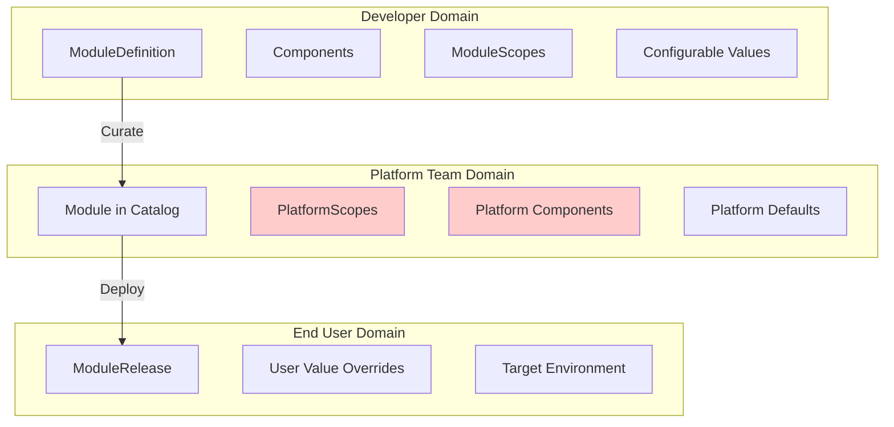
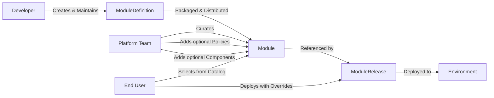

# Open Platform Model (OPM) Architecture Overview

## Introduction

Open Platform Model (OPM) is a cloud-native module architecture that enforces clear separation of concerns between module developers, platform teams, and end users through element composition and deployment hierarchy. OPM enables portable module definitions while maintaining platform control and providing simple deployment experiences.

**OSCAL Integration**: OPM natively integrates OSCAL (Open Security Controls Assessment Language) to provide machine-readable compliance that transforms manual audit processes into continuous, automated validation. Every module automatically generates OSCAL component definitions with built-in security control mappings.

## Core Architecture Principles

### Everything is an Element

OPM's foundational principle is that **every capability, behavior, and resource is expressed as an element**. Elements come in two types - traits (behavioral capabilities) and resources (infrastructure primitives) - unified under a common `#Element` base. Like LEGO blocks, primitive elements (Container, Volume, Network) combine into composite elements (Database, WebService), which compose into complete modules. This creates:

- **Unified mental model**: Components and scopes are element compositions with different purposes
- **Type safety**: CUE enforces type safety
- **Self-documentation**: Every element includes metadata describing its purpose and schema
- **Extensibility**: New elements can be created by composition without breaking existing functionality

### Separation of Concerns

OPM enforces clear boundaries between three key stakeholders through its element composition model and deployment hierarchy:



#### Module Developer Responsibilities

- **Owns**: Components, ModuleScopes, ModuleDefinition
- **Defines**: Module logic, workload types, operational elements
- **Creates**: Portable modules without platform assumptions
- **Cannot**: Modify platform policies or access platform-specific details

#### Platform Team Responsibilities

- **Owns**: PlatformScopes, platform specific elements, Module catalog
- **Enforces**: Security, compliance, and resource governance policies
- **Curates**: Modules from developer definitions
- **Cannot**: Break module portability or modify core module logic

#### End User Responsibilities

- **Owns**: ModuleRelease instances
- **Selects**: Modules from catalog and target environments
- **Configures**: User-specific values and overrides
- **Cannot**: Bypass platform policies or modify module structure

## Element System Architecture

### Element Labels and Kinds

All elements use labels for classification and have a specific kind.

**Common Labels**: Elements typically use labels like `core.opm.dev/category` with values such as `workload`, `data`, `connectivity`, `security`, `observability`, or `governance` to indicate their purpose.

**Kinds**:

- **Primitive**: Single-purpose, fundamental capabilities implemented by the platform
- **Composite**: Combinations of 2+ primitive elements for common patterns
- **Modifier**: Elements that modify behavior or output of other elements
- **Custom**: Platform-specific extensions. A last resort if no other element fits

**Types**:

- **Trait**: Behavioral capabilities (how components behave)
- **Resource**: Infrastructure primitives (what components need)

### Element Targeting

Elements declare where they can be applied:

- `target: ["component"]` - Component-level configuration
- `target: ["scope"]` - Cross-cutting concerns across components
- `target: ["component", "scope"]` - Can be used at either level

### The ElementBase Pattern

All elements use the `#ElementBase` pattern:

```cue
#ElementBase: {
    #metadata: #elements: [elementName=string]: #Element & {#name!: elementName}
    ...  // Critical: enables CUE composition without type conflicts
}

#Container: #ElementBase & {
    #metadata: #elements: Container: #PrimitiveTrait & {
        description: "Single container primitive"
        target: ["component"]
        labels: {"core.opm.dev/category": "workload"}
        #schema: #ContainerSpec
    }
    container: #ContainerSpec
}
```

This pattern solves CUE's structural compatibility requirements while providing automatic element registration.

## Component Architecture

Components are element compositions serving two distinct roles:

### Workload Components

Deployable services with containers:

- **Stateless**: A horizontally scalable containerized workload with no requirement for stable identity or storage
- **Stateful**: A containerized workload that needs stable identity, persistent storage, and ordered lifecycle across replicas
- **Daemon**: A containerized workload meant to run one (or more) instance per node for background or node-local services
- **Task**: A run-to-completion containerized workload that executes and then exits
- **ScheduledTask**: A Task that is triggered repeatedly on a defined schedule

### Resource Components

Non-deployable resource providers:

- **Resource**: Shared resources (ConfigMaps, Secrets, Volumes) for other components

### Resource Sharing

CUE enables simple resource sharing through references: `volumes: dbData: {size: 1G}, container: volumeMount: data: volumes.dbData & {mountPath: "/var/lib/data"}`

## Scope Architecture

Scopes apply cross-cutting concerns to groups of components through element compositions:

### PlatformScope (Immutable)

Platform-controlled policies enforced across applications:

- **Security boundaries**: NetworkPolicy, PodSecurity
- **Resource governance**: ResourceQuota, Priority
- **Compliance requirements**: Audit logging, mandatory metrics

### ModuleScope (Mutable)

Developer-controlled operational concerns:

- **Traffic management**: HTTPRoute, service mesh policies
- **Data locality**: Volume placement, caching strategies
- **Module observability**: Custom metrics, tracing

## Module Lifecycle Flow



### 1. ModuleDefinition (Developer Domain)

- Blueprint with components, scopes, and configurable values
- Portable across platforms
- Includes sensible defaults for immediate deployment

### 2. Module (Platform Catalog)

- Curated version with platform-specific additions
- PlatformScopes applied for policy enforcement
- Platform components added (monitoring, security agents)
- Values may have platform-specific defaults

### 3. ModuleRelease (User Instance)

- References specific Module from catalog
- User-provided value overrides
- Targets specific environment/namespace
- Represents deployable instance

## Value Flow and Configuration

Values cascade through the hierarchy with later stages overriding earlier ones:

```shell
ModuleDefinition defaults → Module overrides → ModuleRelease overrides → Final Configuration
```

All values must be:

- **OpenAPIv3 compliant** with proper types and constraints
- **Well-documented** with clear descriptions
- **Schema validated** at each transformation stage
- **Non-secret** (secrets handled separately through traits)

## Design Guarantees

### Portability

- ModuleDefinitions work across any OPM-compliant platform
- No platform-specific resources in module logic
- Clear abstraction boundaries prevent vendor lock-in

### Policy Enforcement

- PlatformScopes are immutable by developers
- Platform policies cannot be bypassed
- Consistent security and compliance across all modules

### Developer Experience

- Element composition provides building blocks for any module pattern
- Self-documenting schemas reduce learning curve
- Resource sharing through simple CUE references

### Platform Control

- Platform teams control available elements and policies
- Modules can be enhanced without breaking developer intent
- Centralized governance through catalog curation

## Extension Points

### Composition

Platform teams and developers can create new abstractions by composing primitive elements

### Custom Elements

When no existing element exists, a platform can provide their own "custom" elements.

Must follow these patterns:

- MUST provide an element of the kind `custom`
- MUST also provide the transformer to transform this element schema + data to a platform compatible resource
- MUST declare labels, kind, type, target, and schema

### Platform Providers

OPM abstracts over multiple deployment targets:

- **Kubernetes**: Native resource mapping
- **Docker Compose**: Container orchestration
- **Cloud Platforms**: GCP, Azure, AWS, etc

### Platform Extensions

The Platform Provider system is designed to be fully extensible by anyone - from individual developers to entire ecosystem teams. This extensibility operates at two levels:

**Frontend (Element Creation)**: Extension providers can create new Elements that expose their capabilities to module developers. For example, the Crossplane team could create:

- `CrossplaneComposition` element for infrastructure provisioning
- `CrossplaneProvider` element for cloud resource management
- `CrossplaneClaim` element for requesting composed resources

These elements follow OPM's standard patterns, making them immediately usable by any module developer without learning provider-specific APIs.

**Backend (Transformer Implementation)**: Extension providers implement Transformers that convert OPM elements into their platform-specific resources. The Crossplane transformers would:

- Map OPM elements to Crossplane XRDs and Compositions
- Generate appropriate Claims and ProviderConfigs
- Handle the translation between OPM's portable model and Crossplane's resource model

**Integration Example**: A platform team could add Crossplane support to their platform by:

1. Installing the Crossplane extension package (containing Elements and Transformers)
2. Registering the transformers with their OPM runtime
3. Making the new elements available in their module catalog

Module developers can then use Crossplane capabilities through standard OPM elements without knowing the underlying implementation details. Similarly, teams behind ArgoCD, FluxCD, CNPG, or any other cloud-native project can create extensions that integrate seamlessly into the OPM ecosystem.

This architecture enables OPM to provide a consistent module model across diverse platforms while maintaining the flexibility for platform-specific optimizations and policies.

## Inspiration

### Core Inspirations

- **[Open Application Model (OAM)](https://oam.dev)** - The foundational specification that defines the model
- **[CUE Language](https://cuelang.org)** - The powerful configuration language that enables type-safe, composable definitions
- **[KubeVela](https://kubevela.io)** - Reference implementation of OAM that pioneered many patterns for application delivery
- **[Crossplane](https://crossplane.io)** - Infrastructure composition patterns and provider-based architecture
- **[Rudr](https://github.com/oam-dev/rudr)** - Early OAM runtime implementation that validated core concepts

### Design Influences

- **[Timoni](https://timoni.sh)** - CUE-based Kubernetes package manager demonstrating advanced CUE patterns
- **[DevX](https://github.com/stakpak/devx)** - Developer experience patterns and stack composition using CUE
- **[Helm](https://helm.sh)** - Chart structure and templating patterns for Kubernetes applications

### Technical Foundations

- **[Kubernetes](https://kubernetes.io)** - Container orchestration platform and API patterns
- **[Podman](https://podman.io/docs)** - Multi-container application definitions
- **[Docker Compose](https://docs.docker.com/compose/)** - Multi-container application definitions
- **[CNCF Projects](https://www.cncf.io)** - Cloud-native ecosystem standards and best practices
- **[OpenTelemetry](https://opentelemetry.io)** - Observability trait patterns and instrumentation
- **[Open Policy Agent](https://www.openpolicyagent.org)** - Policy framework influencing contractual traits
