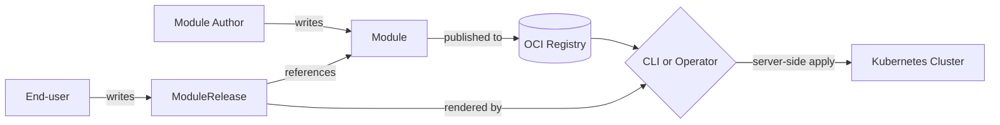

# Concepts Overview

Open Platform Model (OPM) describes applications using a small set of building blocks that compose cleanly. This page introduces each block and how they fit together, with a single worked example.

## Start with an example

Here is one component of a web application written in OPM:

```cue
web: {
    resources_workload.#Container
    traits_workload.#Replicas
    traits_network.#Expose

    spec: {
        container: {
            name:  "web"
            image: "nginx:1.25"
            ports: http: targetPort: 80
        }
        replicas: 4
        expose: ports: http: exposedPort: 8080
    }
}
```

Three things are being mixed in. `#Container` says *what exists*. `#Replicas` and `#Expose` say *how it behaves*. The `spec` block provides the concrete values. Let's unpack what each of these is.

## The building blocks

OPM uses five primitives, arranged from most atomic to most composed.

### [Resource](../glossary.md#resource) — what exists

A Resource is something that physically exists at runtime: a container, a volume, a config map, a secret. Every Component contains at least one Resource.

### [Trait](../glossary.md#trait) — how it behaves

A Trait is an optional modifier that changes a Component's behavior. Traits cover replica counts, network exposure, health probes, restart policy, resource limits, and so on. You pick the Traits you need.

### [Blueprint](../glossary.md#blueprint) — a reusable pattern

A Blueprint bundles Resources and Traits into a pre-assembled pattern. Instead of mixing in `#Container` + `#Replicas` + `#HealthCheck` + `#RestartPolicy` yourself, you use `#StatelessWorkload` which bundles them. Platform teams ship Blueprints as "golden paths" so every team deploys the same well-behaved pattern.

See [Resources, Traits, and Blueprints](resources-traits-blueprints.md) for a side-by-side of raw composition vs. blueprint composition.

### [Component](../glossary.md#component) — a logical part of your app

A Component is what you actually declare in a Module. It is built by composing Resources + Traits (raw) or by applying a Blueprint (pre-bundled). In the snippet above, `web` is one Component. A real application usually has several: `web`, `api`, `worker`, `database`.

### [Policy](../glossary.md#policy) — a rule to follow

A Policy enforces a constraint rather than expressing a preference. Where a Trait says "I want three replicas," a Policy says "this workload must not run as root." Policies can **block**, **warn**, or **audit** on violation. Governance teams use Policies to keep platform rules out of application code.

## From definition to running app

Components live inside a [Module](../glossary.md#module). A Module is the portable, reusable definition of an application — it declares its Components, a `#config` schema listing which values are tunable, and sane defaults. Module authors publish Modules to a registry.

A [ModuleRelease](../glossary.md#modulerelease) is the concrete deployment. It references a Module, supplies the final values for this environment, and targets a specific namespace. Consumers write ModuleReleases — they do not need to understand the Module's internals, only the `#config` schema it exposes.



The split separates concerns cleanly: authors own the Module, end-users own the values, platforms own the Policies.

See [Module and ModuleRelease](module-and-release.md) for the full two-layer walkthrough.

## Where does the YAML come from?

OPM is pure CUE — there is no templating, no string interpolation. At build time, a [Provider](../glossary.md#provider) runs a chain of [Transformers](../glossary.md#transformer) that convert OPM definitions into runtime-specific resources. The Kubernetes provider, for example, turns a stateless Component into a Deployment, a stateful one into a StatefulSet, an `#Expose` Trait into a Service, and so on.

The [CLI](../cli.md) runs this locally (push model). The [operator](../operator.md) runs it in-cluster against a ModuleRelease CRD (pull / GitOps model). Either way the rendering logic is the same.

## Next steps

- **Try it**: [Getting Started](../getting-started.md)
- **Go deeper on composition**: [Resources, Traits, and Blueprints](resources-traits-blueprints.md)
- **See the two-layer split in full**: [Module and ModuleRelease](module-and-release.md)
- **Browse real modules**: [Module Gallery](../modules-gallery.md)
- **Read the deeper architecture doc**: [Architecture](../architecture.md)
- **See the canonical schema reference**: [catalog/docs/core/definition-types.md](../../../catalog/docs/core/definition-types.md)
