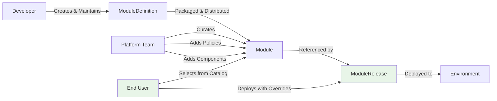

# ModuleRelease - Lifecycle

## What is a ModuleRelease

ModuleReleases are end-user instances of Modules from the catalog. They reference a specific Module and allow users to override the configurable values. This is what actually gets deployed to the platform, representing a specific configuration of a module for a particular use case or environment.

The ModuleRelease is the **deployment instance** - the final, configured version of a module ready to run in a specific environment with user-specific settings and overrides.

## Role in the Module Lifecycle

ModuleReleases represent the **end-user domain** in OPM's separation of concerns:



**End-User Ownership**: End users own ModuleReleases and their configuration overrides.

**Module Reference**: ModuleReleases reference specific Modules from the platform catalog.

**Environment Targeting**: Each ModuleRelease targets a specific environment or namespace.

**Configuration Finalization**: This is where the final configuration gets determined through value cascading.

## End User Responsibilities

End users have specific capabilities and constraints when creating ModuleReleases:

### What End Users CAN Do

1. **Select Module**: Choose any Module from the platform catalog
2. **Override Values**: Modify any configurable values defined in the Module's values schema
3. **Target Environment**: Specify which namespace/environment to deploy to
4. **Control Deployment**: Trigger deployments, rollbacks, and scaling operations
5. **Monitor Status**: View deployment status and module health

### What End Users CANNOT Do

1. **Modify Structure**: Cannot change components, scopes, or module architecture
2. **Bypass Policies**: Cannot override immutable PlatformScopes or security policies
3. **Access Raw Definitions**: Cannot directly modify ModuleDefinitions
4. **Violate Constraints**: Cannot set values outside defined validation constraints

## Value Cascading and Final Configuration

The final configuration results from cascading values through the entire hierarchy:

```shell
ModuleDefinition defaults → Module overrides → ModuleRelease overrides → Final Configuration
```

### Value Precedence Rules

1. **ModuleRelease values** take highest precedence (user overrides)
2. **Module values** override ModuleDefinition defaults (platform defaults)
3. **ModuleDefinition values** provide base defaults (developer defaults)
4. **Validation applies** at every level - invalid values are rejected

## ModuleRelease Structure

```cue
#ModuleRelease: {
    #apiVersion: "core.opm.dev/v1"
    #kind:       "ModuleRelease"
    #metadata: {
        name:         #NameType
        namespace?:   #NameType | *"default"

        labels?:      #LabelsType
        annotations?: #AnnotationsType
    }

    // Reference to Module from catalog
    #module: #Module

    // Read values from module
    if #module.values != _|_ {values?: #module.values}

    // User overrides for configurable values
    values?: {
        ...
    }

    #status?: {
        deployedAt?:    string
        moduleVersion:  #module.#metadata.version
    }
}
```

## ModuleRelease Rules

### Reference Rules

1. **Valid Reference**: MUST reference existing Module in catalog
2. **Version Pinning**: Should reference specific Module versions for predictability
3. **Catalog Compliance**: Can only reference Modules available in the platform catalog

### Value Rules

1. **Type Compliance**: Overridden values MUST comply with types/constraints defined in Module
2. **Validation Required**: All value overrides must pass schema validation
3. **No Structural Changes**: Can ONLY modify values, not components/scopes
4. **Secret Handling**: Sensitive values should be handled through appropriate secret management

### Deployment Rules

1. **Environment Targeting**: Must specify valid target environment/namespace
2. **Resource Compliance**: Final configuration must comply with platform resource policies
3. **Policy Enforcement**: Cannot bypass immutable PlatformScopes or security policies

## ModuleRelease Examples

### Development Environment Deployment

```cue
package webAppDev

import (
    catalog "platform.company.com/catalog/simple-web-app:1.0.0-platform.1"
)

#ModuleRelease & {
    #metadata: {
        name: "web-app-dev"
        namespace: "development"
        labels: {
            environment: "development"
            team: "frontend"
            owner: "john.doe@company.com"
        }
    }

    #module: catalog.#Module

    values: {
        // Development-specific overrides
        replicas: 1  // Single replica for development

        image: {
            tag: "dev-latest"  // Use latest development image
        }

        environment: "development"

        // Platform-specific values
        platform: {
            monitoring: {
                enabled: false  // Disable monitoring in dev
                level: "basic"
            }
            backup: {
                enabled: false  // No backups needed in dev
            }
            alerts: {
                email: "john.doe@company.com"  // Personal alerts
                severity: "low"
            }
        }
    }
}
```

### Production Environment with High Availability

```cue
package webAppProd

import (
    catalog "platform.company.com/catalog/simple-web-app:1.0.0-platform.1"
)

#ModuleRelease & {
    #metadata: {
        name: "web-app-prod"
        namespace: "production"
        labels: {
            environment: "production"
            team: "frontend"
            criticality: "high"
            owner: "frontend-team@company.com"
        }
        annotations: {
            "deployment.company.com/change-request": "CR-2024-0156"
            "deployment.company.com/approved-by": "platform-team@company.com"
        }
    }

    #module: catalog.#Module

    values: {
        // Production configuration
        replicas: 5  // High availability setup

        image: {
            tag: "v1.0.0"  // Use stable, tested version
        }

        environment: "production"

        platform: {
            monitoring: {
                enabled: true
                level: "detailed"  // Comprehensive monitoring
            }
            backup: {
                enabled: true
                schedule: "0 2 * * *"  // Daily backups
            }
            alerts: {
                email: "frontend-oncall@company.com"
                severity: "high"  // Critical alerts for production
            }
        }
    }
}
```

### E-commerce Platform Multi-Environment

```cue
package ecommerceStaging

import (
    catalog "platform.company.com/catalog/ecommerce-platform:2.1.0-enterprise.3"
)

#ModuleRelease & {
    #metadata: {
        name: "ecommerce-staging"
        namespace: "ecommerce-staging"
        labels: {
            environment: "staging"
            module: "ecommerce"
            team: "platform"
            cost-center: "ecommerce-bu"
        }
    }

    #module: catalog.#Module

    values: {
        // Staging environment configuration
        frontend: {
            image: {
                tag: "v2.1.1-rc.2"  // Release candidate testing
            }
            replicas: 2  // Reduced capacity for staging
        }

        backend: {
            image: {
                tag: "v2.1.1-rc.2"
            }
            replicas: 2
        }

        database: {
            name: "ecommerce_staging"
            user: "ecommerce_staging_user"
            password: "staging-secure-password-123"
            storage: {
                size: "50Gi"  // Smaller storage for staging
            }
        }

        environment: "staging"

        ingress: {
            host: "staging.ecommerce.company.com"
        }

        // Platform configuration for staging
        platform: {
            monitoring: {
                enabled: true
                level: "detailed"  // Full monitoring to catch issues
                retention: "30d"   // Shorter retention
                alerts: {
                    email: ["ecommerce-dev@company.com", "platform-team@company.com"]
                    slack: "#ecommerce-staging"
                    pagerduty: ""  // No pager duty for staging
                }
            }
            backup: {
                enabled: true
                schedule: "0 4 * * *"  // Different backup time
                retention: "7d"       // Shorter retention
                encryption: true
            }
            compliance: {
                pciDss: true   // Test compliance in staging
                sox: false     // Not required for staging
                scanSchedule: "0 8 * * 1"  // Weekly scans
            }
            networking: {
                serviceMesh: true
                networkPolicies: true
                mtls: true  // Test security features
            }
        }
    }
}
```

### Custom Configuration for Specific Use Case

```cue
package ecommerceAnalytics

import (
    catalog "platform.company.com/catalog/ecommerce-platform:2.1.0-enterprise.3"
)

#ModuleRelease & {
    #metadata: {
        name: "ecommerce-analytics"
        namespace: "analytics"
        labels: {
            environment: "production"
            use-case: "analytics"
            team: "data-science"
            data-classification: "confidential"
        }
    }

    #module: catalog.#Module

    values: {
        // Analytics-optimized configuration
        frontend: {
            replicas: 1  // Minimal frontend for internal use
        }

        backend: {
            replicas: 8  // High backend capacity for data processing
        }

        database: {
            name: "ecommerce_analytics"
            user: "analytics_user"
            password: "analytics-secure-password-456"
            maxConnections: 300  // Higher connection limit for analytics
            storage: {
                size: "500Gi"  // Large storage for analytics data
            }
        }

        environment: "production"

        // Analytics-specific caching
        caching: {
            size: "2Gi"  // Larger cache for analytics queries
        }

        ingress: {
            host: "analytics.internal.company.com"
        }

        // Analytics monitoring configuration
        platform: {
            monitoring: {
                enabled: true
                level: "enterprise"
                retention: "180d"  // Longer retention for trend analysis
                alerts: {
                    email: ["data-science@company.com", "analytics-oncall@company.com"]
                    slack: "#analytics-alerts"
                    pagerduty: "analytics-service-key"
                }
            }
            backup: {
                enabled: true
                schedule: "0 1 * * *"  // Earlier backup time
                retention: "180d"     // Long-term retention
                encryption: true
            }
            compliance: {
                pciDss: true
                sox: true      // Analytics data requires SOX compliance
                hipaa: false
                scanSchedule: "0 6 * * 0"  // Weekly Sunday scans
            }
        }
    }
}
```

### Multi-Tenant SaaS Deployment

```cue
package ecommerceTenant

import (
    catalog "platform.company.com/catalog/ecommerce-platform:2.1.0-enterprise.3"
)

#ModuleRelease & {
    #metadata: {
        name: "ecommerce-tenant-acme"
        namespace: "tenant-acme"
        labels: {
            environment: "production"
            tenant: "acme-corp"
            tier: "premium"
            region: "us-west"
        }
        annotations: {
            "tenant.company.com/customer-id": "cust-12345"
            "tenant.company.com/contract": "premium-annual"
        }
    }

    #module: catalog.#Module

    values: {
        // Tenant-specific configuration
        frontend: {
            image: {
                tag: "v2.1.0-tenant"  // Multi-tenant aware version
            }
            replicas: 3  // Premium tier gets higher availability
        }

        backend: {
            image: {
                tag: "v2.1.0-tenant"
            }
            replicas: 4
        }

        database: {
            name: "ecommerce_acme"
            user: "acme_user"
            password: "tenant-acme-secure-password-789"
            maxConnections: 150  // Tenant-specific connection limit
            storage: {
                size: "200Gi"  // Premium tier storage allocation
            }
        }

        environment: "production"

        ingress: {
            host: "acme.ecommerce.company.com"
        }

        // Tenant-specific platform configuration
        platform: {
            monitoring: {
                enabled: true
                level: "enterprise"
                retention: "90d"
                alerts: {
                    email: ["support@company.com", "acme-support@acmecorp.com"]
                    slack: "#tenant-acme"
                }
            }
            backup: {
                enabled: true
                schedule: "0 3 * * *"
                retention: "90d"
                encryption: true
            }
            compliance: {
                pciDss: true
                sox: false  // Customer doesn't require SOX
                scanSchedule: "0 7 * * 0"
            }
            networking: {
                serviceMesh: true
                networkPolicies: true
                mtls: true
            }
        }
    }
}
```

## Best Practices

### Module Selection

1. **Version Pinning**: Always reference specific Module versions for predictable deployments
2. **Catalog Awareness**: Understand what Modules are available and their capabilities
3. **Environment Matching**: Choose Modules that support your target environment requirements
4. **Feature Compatibility**: Ensure the Module version includes features you need

### Value Configuration

1. **Environment-Specific Values**: Tailor configuration to match environment needs (dev vs staging vs prod)
2. **Resource Appropriateness**: Set resource limits appropriate for environment and workload
3. **Security Consciousness**: Use strong passwords and appropriate security settings
4. **Monitoring Configuration**: Configure monitoring and alerting appropriately for environment criticality

### Deployment Strategy

1. **Clear Naming**: Use descriptive names that indicate environment and purpose
2. **Proper Labeling**: Apply consistent labels for organization and management
3. **Change Management**: Follow organizational change management processes for production deployments
4. **Documentation**: Document any special configuration decisions or overrides

### Environment Management

1. **Namespace Organization**: Use clear namespace strategies to separate environments
2. **Resource Isolation**: Ensure appropriate resource isolation between environments
3. **Access Controls**: Apply proper RBAC and access controls for each environment
4. **Backup Strategies**: Configure appropriate backup and disaster recovery for each environment

### Multi-Tenancy Considerations

1. **Tenant Isolation**: Ensure proper isolation between tenant deployments
2. **Resource Allocation**: Allocate resources fairly based on tenant tiers/contracts
3. **Data Separation**: Ensure tenant data is properly separated and secured
4. **Custom Configuration**: Allow tenant-specific configuration while maintaining security

ModuleReleases provide the final step in OPM's module lifecycle, enabling end users to deploy modules with confidence while maintaining organizational policies and platform security. They represent the balance between user flexibility and platform governance that makes OPM effective for enterprise deployments.
