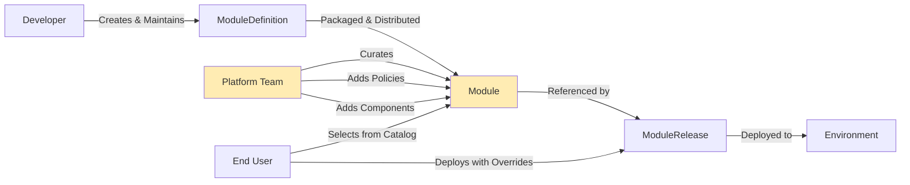

# Module - Lifecycle

## What is a Module

Modules are curated entries in the platform catalog, derived from ModuleDefinitions. Platform teams transform ModuleDefinitions into Modules by potentially adding platform-specific components (monitoring sidecars, policy agents) and applying PlatformScopes that enforce organizational policies. This represents the platform-ready version of a module that end users can deploy.

The Module is the **packaged, distributable unit** that lives in the platform catalog. It's the complete CUE module that contains everything needed to deploy a module while respecting platform constraints and policies.

## Role in the Module Lifecycle

Modules represent the **platform domain** in OPM's separation of concerns:



**Platform Ownership**: Platform teams own the curation process and the resulting Modules in the catalog.

**Policy Application**: This is where organizational policies get applied through PlatformScopes and platform components.

**Catalog Management**: Modules form the curated catalog that end users choose from for deployment.

## Platform Team Responsibilities

Platform teams have specific responsibilities and constraints when curating Modules:

### What Platform Teams CAN Do

1. **Add PlatformScopes**: Apply immutable scopes that enforce organizational policies
2. **Add Platform Components**: Insert monitoring agents, security sidecars, compliance tools
3. **Modify Value Defaults**: Change default values to match platform standards
4. **Add Value Fields**: Extend the values schema with platform-specific options
5. **Apply Labels/Annotations**: Add platform-specific metadata
6. **Set Resource Constraints**: Add platform-appropriate resource limits and requests

### What Platform Teams CANNOT Do

1. **Modify Core Logic**: Cannot remove or change components from ModuleDefinition
2. **Remove Developer Scopes**: Cannot remove ModuleScopes defined by developers
3. **Break Portability**: Cannot make changes that prevent module from working on other platforms
4. **Modify Component Configuration**: Cannot change the essential behavior of developer-defined components

## Module Structure

```cue
#Module: {
    #apiVersion: "core.opm.dev/v1"
    #kind:       "Module"
    #metadata: {
        name:         #NameType
        version?:     #VersionType

        labels?:      #LabelsAnnotationsType
        annotations?: #LabelsAnnotationsType
    }

    #moduleDefinition: #ModuleDefinition

    // Platform can add components but not remove
    components?: #moduleDefinition.components
    components?: [Id=string]: #Component & {
        #metadata: #id: Id
    }

    // Platform can add scopes but not remove
    if #moduleDefinition.scopes != _|_ {scopes?: #moduleDefinition.scopes}
    scopes?: [Id=string]: #Scope & {
        #metadata: #id: Id
    }

    // Platform can modify defaults but not structure
    values?: #moduleDefinition.values & {
        ...
    }

    #status?: {
        componentCount: len(components)
        scopeCount:     len(scopes)
        platformScopes: [
            for id, scope in scopes if scope.#metadata.immutable {id}
        ]
    }
}
```

## Module Rules

### Preservation Rules

1. **Preserve Core Logic**: Cannot remove or modify components/scopes from ModuleDefinition
2. **Maintain Compatibility**: All original ModuleDefinition functionality must remain intact
3. **Respect Developer Intent**: Platform additions should enhance, not override, developer decisions

### Enhancement Rules

1. **Additive Only**: Platform additions MUST NOT break original functionality
2. **Platform Component Naming**: Platform-added components SHOULD use clear naming convention (e.g., `platform-*`)
3. **Scope Immutability**: PlatformScopes added must be marked as immutable
4. **Value Compatibility**: Value modifications must maintain backward compatibility

### Catalog Rules

1. **Catalog Uniqueness**: name + version combination MUST be unique within catalog
2. **Semantic Versioning**: Should follow semver for predictable upgrade paths
3. **Clear Provenance**: Should maintain clear link to source ModuleDefinition

## Module Examples

### Basic Web Module with Platform Enhancements

```cue
package webAppPlatform

import (
    originalModule "github.com/company/web-app/v1.0.0"
    traits "traits.opm.dev/v1alpha1"
)

#Module & {
    #metadata: {
        name: "simple-web-app"
        version: "1.0.0-platform.1"
        labels: {
            "platform.company.com/catalog": "web-modules"
            "platform.company.com/support-tier": "standard"
        }
    }

    #moduleDefinition: originalModule.#ModuleDefinition

    // Inherit all original components
    components: #moduleDefinition.components

    // Add platform monitoring component
    components: {
        "platform-monitoring": #WorkloadComponent & {
            #metadata: {
                type: "Workload"
                workloadType: "Daemon"
                labels: {
                    "platform.company.com/component": "monitoring-agent"
                }
            }
            traits.#Container

            container: {
                name: "monitoring-agent"
                image: {
                    repository: "platform.company.com/monitoring/agent"
                    tag: "v2.1.0"
                }
                env: [
                    {
                        name: "TARGET_SERVICE"
                        value: "web-server"
                    },
                    {
                        name: "METRICS_ENDPOINT"
                        value: "http://metrics-collector.platform.svc.cluster.local:9090"
                    }
                ]
            }
        }

        "platform-security": #WorkloadComponent & {
            #metadata: {
                type: "Workload"
                workloadType: "Stateless"
                labels: {
                    "platform.company.com/component": "security-sidecar"
                }
            }
            traits.#Container

            container: {
                name: "security-proxy"
                image: {
                    repository: "platform.company.com/security/proxy"
                    tag: "v1.5.0"
                }
                ports: [{
                    name: "proxy"
                    containerPort: 8443
                }]
            }
        }
    }

    // Add platform scopes
    scopes: #moduleDefinition.scopes

    scopes: {
        "platform-security-policy": #PlatformScope & {
            #metadata: {
                immutable: true
            }
            traits.#PodSecurity

            podSecurity: {
                runAsNonRoot: true
                runAsUser: 10001
                fsGroup: 10001
                seccompProfile: {
                    type: "RuntimeDefault"
                }
                capabilities: {
                    drop: ["ALL"]
                    add: ["NET_BIND_SERVICE"]
                }
            }

            appliesTo: "*"  // Apply to all components
        }

        "platform-resource-limits": #PlatformScope & {
            #metadata: {
                immutable: true
            }
            traits.#ResourceLimit

            resourceLimit: {
                defaultRequest: {
                    cpu: "100m"
                    memory: "128Mi"
                }
                defaultLimit: {
                    cpu: "500m"
                    memory: "512Mi"
                }
                maxLimitRequestRatio: {
                    cpu: 4
                    memory: 4
                }
            }

            appliesTo: "*"
        }

        "platform-network-policy": #PlatformScope & {
            #metadata: {
                immutable: true
            }
            traits.#NetworkPolicy

            networkPolicy: {
                policyTypes: ["Ingress", "Egress"]
                ingress: [{
                    from: [{
                        namespaceSelector: {
                            matchLabels: {
                                "platform.company.com/network-zone": "web"
                            }
                        }
                    }]
                }]
                egress: [{
                    to: [{
                        namespaceSelector: {
                            matchLabels: {
                                "platform.company.com/network-zone": "web"
                            }
                        }
                    }]
                }, {
                    // Allow DNS
                    to: []
                    ports: [{
                        protocol: "UDP"
                        port: 53
                    }]
                }]
            }

            appliesTo: [components.webServer]
        }
    }

    // Modify value defaults for platform standards
    values: #moduleDefinition.values & {
        replicas: uint & >=1 & <=10 | *2  // Platform prefers 2 replicas minimum
        image: {
            repository: string | *"registry.company.com/web-apps/nginx"  // Use company registry
            tag: string | *"1.21-secure"  // Use security-hardened image
        }
        environment: "development" | "staging" | "production" | *"staging"  // Default to staging

        // Add platform-specific values
        platform?: {
            monitoring?: {
                enabled?: bool | *true
                level?: "basic" | "detailed" | *"basic"
            }
            backup?: {
                enabled?: bool | *true
                schedule?: string | *"0 2 * * *"  // Daily at 2 AM
            }
            alerts?: {
                email?: string | *"platform-team@company.com"
                severity?: "low" | "medium" | "high" | *"medium"
            }
        }
    }
}
```

### Enterprise Module with Comprehensive Platform Integration

```cue
package ecommercePlatform

import (
    originalModule "github.com/company/ecommerce-platform/v2.1.0"
    traits "traits.opm.dev/v1alpha1"
)

#Module & {
    #metadata: {
        name: "ecommerce-platform"
        version: "2.1.0-enterprise.3"
        labels: {
            "platform.company.com/catalog": "enterprise-modules"
            "platform.company.com/support-tier": "premium"
            "platform.company.com/compliance": "pci-dss"
        }
        annotations: {
            "platform.company.com/cost-center": "ecommerce-bu"
            "platform.company.com/data-classification": "restricted"
        }
    }

    #moduleDefinition: originalModule.#ModuleDefinition

    // Inherit and extend components
    components: #moduleDefinition.components

    // Add comprehensive platform components
    components: {
        "platform-istio-sidecar": #ResourceComponent & {
            #metadata: {
                type: "Resource"
            }
            traits.#ConfigMap

            configMaps: {
                istioConfig: {
                    data: {
                        mesh: "service-mesh"
                        proxyImage: "platform.company.com/istio/proxyv2:1.16.0"
                        tracing: "jaeger.platform.svc.cluster.local:14268"
                    }
                }
            }
        }

        "platform-backup": #WorkloadComponent & {
            #metadata: {
                type: "Workload"
                workloadType: "ScheduledTask"
            }
            traits.#Container

            container: {
                name: "backup-agent"
                image: {
                    repository: "platform.company.com/backup/velero"
                    tag: "v1.9.0"
                }
                command: ["backup-script.sh"]
                env: [
                    {
                        name: "S3_BUCKET"
                        value: "company-backups-prod"
                    },
                    {
                        name: "BACKUP_SCHEDULE"
                        value: values.platform.backup.schedule
                    }
                ]
            }
        }

        "platform-compliance": #WorkloadComponent & {
            #metadata: {
                type: "Workload"
                workloadType: "Daemon"
            }
            traits.#Container

            container: {
                name: "compliance-agent"
                image: {
                    repository: "platform.company.com/compliance/scanner"
                    tag: "v3.2.0"
                }
                env: [
                    {
                        name: "COMPLIANCE_FRAMEWORK"
                        value: "PCI-DSS"
                    },
                    {
                        name: "SCAN_INTERVAL"
                        value: "1h"
                    }
                ]
            }
        }
    }

    // Add comprehensive platform scopes
    scopes: #moduleDefinition.scopes

    scopes: {
        "platform-pci-compliance": #PlatformScope & {
            #metadata: {
                immutable: true
            }
            traits.#CompliancePolicy

            compliancePolicy: {
                framework: "PCI-DSS"
                version: "4.0"
                requirements: [
                    {
                        id: "2.2.1"
                        description: "Configuration standards for system components"
                        controls: [
                            "disable-unused-services",
                            "secure-protocols-only",
                            "remove-default-accounts"
                        ]
                    },
                    {
                        id: "8.2.3"
                        description: "Strong authentication for all users"
                        controls: [
                            "multi-factor-authentication",
                            "strong-password-policy"
                        ]
                    }
                ]
                auditLog: true
                scanInterval: "6h"
            }

            appliesTo: "*"
        }

        "platform-service-mesh": #PlatformScope & {
            #metadata: {
                immutable: true
            }
            traits.#ServiceMesh

            serviceMesh: {
                provider: "istio"
                version: "1.16.0"
                mtls: {
                    mode: "STRICT"
                }
                telemetry: {
                    tracing: true
                    metrics: true
                    accessLogs: true
                }
                traffic: {
                    outlierDetection: true
                    circuitBreaker: true
                    retries: {
                        attempts: 3
                        timeout: "10s"
                    }
                }
            }

            appliesTo: [components.frontend, components.backend]
        }

        "platform-audit": #PlatformScope & {
            #metadata: {
                immutable: true
            }
            traits.#AuditPolicy

            auditPolicy: {
                level: "RequestResponse"
                namespaces: ["ecommerce-prod", "ecommerce-staging"]
                resources: [{
                    group: ""
                    resources: ["secrets", "configmaps"]
                    resourceNames: []
                }]
                omitStages: ["RequestReceived"]
                auditBackend: {
                    webhook: {
                        throttle: {
                            qps: 10
                            burst: 15
                        }
                        clientConfig: {
                            url: "https://audit-collector.platform.company.com/webhook"
                        }
                    }
                }
            }

            appliesTo: "*"
        }

        "platform-disaster-recovery": #PlatformScope & {
            #metadata: {
                immutable: true
            }
            traits.#DisasterRecovery

            disasterRecovery: {
                rpo: "1h"    // Recovery Point Objective
                rto: "4h"    // Recovery Time Objective
                backupStrategy: {
                    type: "incremental"
                    schedule: "0 */6 * * *"  // Every 6 hours
                    retention: "30d"
                    destinations: [
                        "s3://company-dr-backups/ecommerce",
                        "gcs://company-dr-backups-secondary/ecommerce"
                    ]
                }
                replicationStrategy: {
                    type: "async"
                    targetRegions: ["us-west-2", "eu-central-1"]
                }
            }

            appliesTo: [components.database]
        }
    }

    // Enhanced platform values
    values: #moduleDefinition.values & {
        // Override defaults for enterprise standards
        frontend: {
            image: {
                repository: string | *"registry.company.com/ecommerce/frontend"
                tag: string | *"v2.1.0-enterprise"
            }
            replicas: uint & >=2 & <=20 | *3  // Enterprise minimum
        }

        backend: {
            image: {
                repository: string | *"registry.company.com/ecommerce/backend"
                tag: string | *"v2.1.0-enterprise"
            }
            replicas: uint & >=3 & <=50 | *5  // Higher availability
        }

        database: {
            password: string & strings.MinRunes(16) | *"generated-secure-password"  // Stronger password requirement
            storage: {
                size: string | *"100Gi"  // Enterprise storage minimum
            }
        }

        // Add comprehensive platform configuration
        platform?: {
            monitoring?: {
                enabled?: bool | *true
                level?: "basic" | "detailed" | "enterprise" | *"enterprise"
                retention?: string | *"90d"
                alerts?: {
                    email?: [...string] | *["platform-team@company.com", "ecommerce-oncall@company.com"]
                    slack?: string | *"#ecommerce-alerts"
                    pagerduty?: string | *"ecommerce-service-key"
                }
            }
            backup?: {
                enabled?: bool | *true
                schedule?: string | *"0 2 * * *"
                retention?: string | *"90d"
                encryption?: bool | *true
            }
            compliance?: {
                pciDss?: bool | *true
                sox?: bool | *true
                hipaa?: bool | *false
                scanSchedule?: string | *"0 */6 * * *"
            }
            networking?: {
                serviceMesh?: bool | *true
                networkPolicies?: bool | *true
                mtls?: bool | *true
            }
        }
    }
}
```

## Best Practices

### Curation Strategy

1. **Selective Enhancement**: Only add platform components that provide clear value without overwhelming the module
2. **Clear Naming**: Use consistent naming conventions for platform-added components (e.g., `platform-*`)
3. **Minimal Disruption**: Ensure platform additions don't interfere with module functionality
4. **Policy Alignment**: Apply platform scopes that align with organizational requirements

### Value Management

1. **Preserve Flexibility**: Don't over-constrain values unless required for policy compliance
2. **Sensible Defaults**: Change defaults to match platform standards while maintaining compatibility
3. **Clear Documentation**: Document any platform-specific value additions or changes
4. **Backward Compatibility**: Ensure value changes don't break existing deployments

### Scope Application

1. **Security First**: Apply security-related PlatformScopes consistently
2. **Resource Governance**: Use resource-related scopes to prevent resource exhaustion
3. **Compliance Requirements**: Apply compliance scopes based on data classification and regulatory needs
4. **Clear Boundaries**: Ensure scope targeting is precise and well-documented

### Catalog Management

1. **Version Clearly**: Use clear versioning that indicates platform modifications (e.g., `-platform.1`, `-enterprise.2`)
2. **Maintain Provenance**: Keep clear links to source ModuleDefinitions
3. **Regular Updates**: Keep platform components and policies up to date
4. **Testing**: Thoroughly test Modules before adding to catalog

Modules serve as the bridge between developer intent and platform requirements, enabling organizations to maintain control while preserving module portability and developer productivity.
