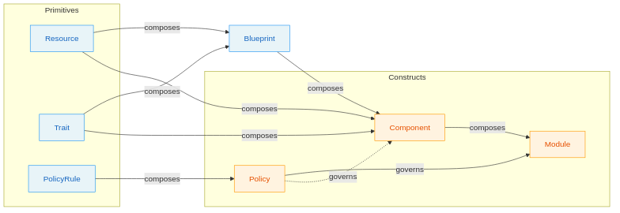
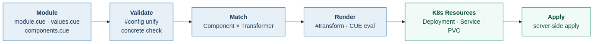

<style>
  :root {
    --color-background: #fff;
    --color-foreground: #333;
  }
  section {
    font-size: 26px;
  }
  section.lead h1 {
    font-size: 2.4em;
  }
  section.lead h2 {
    font-size: 1.3em;
    font-weight: normal;
    color: #666;
  }
  section code {
    font-size: 0.85em;
  }
  section pre {
    font-size: 0.78em;
  }
  section.small-code pre {
    font-size: 0.68em;
  }
  section table {
    font-size: 0.85em;
  }
  section.two-col {
    display: grid;
    grid-template-columns: 1fr 1fr;
    gap: 1em;
  }
  blockquote {
    border-left: 5px solid #FF9800;
    padding: 0.6em 1em;
    font-style: normal;
    font-size: 1.1em;
    color: #444;
    background: #fff8f0;
    border-radius: 4px;
  }
  /* Section divider slides: full colored background */
  section.lead.why  { background: #c0392b; color: #fff; }
  section.lead.how  { background: #2471a3; color: #fff; }
  section.lead.real { background: #1a8a6a; color: #fff; }
  section.lead.demo { background: #7d3c98; color: #fff; }
  section.lead.road { background: #2c3e50; color: #fff; }
  section.lead.why h1,  section.lead.why h2,
  section.lead.how h1,  section.lead.how h2,
  section.lead.real h1, section.lead.real h2,
  section.lead.demo h1, section.lead.demo h2,
  section.lead.road h1, section.lead.road h2 { color: #fff; }
  section.lead.why blockquote, section.lead.how blockquote,
  section.lead.real blockquote, section.lead.demo blockquote,
  section.lead.road blockquote {
    background: rgba(255,255,255,0.15);
    border-left-color: rgba(255,255,255,0.6);
    color: #fff;
  }
  /* Content slides: colored top banner strip */
  section.why:not(.lead)::before,
  section.how:not(.lead)::before,
  section.real:not(.lead)::before,
  section.demo:not(.lead)::before,
  section.road:not(.lead)::before {
    content: '';
    position: absolute;
    top: 0; left: 0; right: 0;
    height: 20px;
  }
  section.why:not(.lead)::before  { background: #c0392b; }
  section.how:not(.lead)::before  { background: #2471a3; }
  section.real:not(.lead)::before { background: #1a8a6a; }
  section.demo:not(.lead)::before { background: #7d3c98; }
  section.road:not(.lead)::before { background: #2c3e50; }
  /* Two-col with full-width footer */
  section.two-col-footer {
    display: grid;
    grid-template-columns: 1fr 1fr;
    gap: 1em;
  }
  section.two-col-footer h1,
  section.two-col-footer .footer {
    grid-column: 1 / -1;
  }
  /* Pain slides (Helm) — red banner + warm tint */
  section.pain { background-color: #fdf2f2; }
  section.pain::before { background: #c0392b !important; }
  /* Answer slides (OPM) — teal banner + cool tint */
  section.answer { background-color: #f0faf7; }
  section.answer::before { background: #1a8a6a !important; }
  /* Accent colors for key concepts */
  .app-model  { color: #2471a3; font-weight: bold; }
  .plat-model { color: #1a8a6a; font-weight: bold; }
  /* Roadmap timeline */
  .timeline {
    display: flex;
    align-items: flex-start;
    justify-content: space-between;
    position: relative;
    margin: 2.5em 0 1em;
    padding: 0;
  }
  .timeline::before {
    content: '';
    position: absolute;
    top: 22px;
    left: 5%;
    right: 5%;
    height: 3px;
    background: linear-gradient(to right, #1a8a6a 20%, #95a5a6 20%);
  }
  .timeline-stop {
    display: flex;
    flex-direction: column;
    align-items: center;
    flex: 1;
    position: relative;
    z-index: 1;
  }
  .timeline-dot {
    width: 44px;
    height: 44px;
    border-radius: 50%;
    border: 3px solid #95a5a6;
    background: #fff;
    display: flex;
    align-items: center;
    justify-content: center;
    font-size: 1.2em;
    line-height: 1;
    overflow: hidden;
    margin-bottom: 0.6em;
    flex-shrink: 0;
  }
  @keyframes pulse {
    0%, 100% { box-shadow: 0 0 0 5px rgba(26,138,106,0.2); }
    50%      { box-shadow: 0 0 0 13px rgba(26,138,106,0.12); }
  }
  .timeline-stop.now .timeline-dot {
    background: #1a8a6a;
    border-color: #1a8a6a;
    color: #fff;
    animation: pulse 2s ease-in-out infinite;
  }
  .timeline-stop.now .timeline-dot::after {
    content: '';
    width: 0;
    height: 0;
    border-style: solid;
    border-width: 8px 0 8px 14px;
    border-color: transparent transparent transparent #fff;
    margin-left: 3px;
  }
  .timeline-stop.next .timeline-dot {
    border-color: #2c3e50;
    border-style: dashed;
    color: #2c3e50;
  }
  .timeline-stop.future .timeline-dot {
    border-color: #bdc3c7;
    color: #bdc3c7;
  }
  .timeline-label {
    font-weight: bold;
    font-size: 0.85em;
    text-align: center;
    color: #2c3e50;
  }
  .timeline-stop.future .timeline-label {
    color: #95a5a6;
  }
  .timeline-badge {
    font-size: 0.65em;
    font-weight: bold;
    letter-spacing: 0.05em;
    text-transform: uppercase;
    padding: 0.15em 0.5em;
    border-radius: 3px;
    margin: 0.3em 0 0.4em;
  }
  .badge-now  { background: #1a8a6a; color: #fff; }
  .badge-next { background: #2c3e50; color: #fff; }
  .timeline-desc {
    font-size: 0.7em;
    text-align: center;
    color: #666;
    line-height: 1.4;
    max-width: 160px;
  }
  .timeline-stop.future .timeline-desc {
    color: #aaa;
  }
</style>

<!-- _class: lead -->

# OPM

## Open Platform Model

Type-safe, composable, self-describing application definitions
Built on CUE — distributed via OCI

<!--
~50 min presentation. Live cluster. Team audience: heavy Helm users, first time seeing OPM.
-->

---

<!-- _class: two-col-footer -->

# Two Models, One Platform

<div>

### <span class="app-model">Application Model</span>

Define, compose, and distribute applications.
Aims to replace Helm.

> *What does my app need?*

</div>
<div>

### <span class="plat-model">Platform Model</span>

Providers register capabilities in a standard format.
Platform operators assemble environments from multiple providers.

> *Who provides it?*

</div>

<div class="footer">

**This talk: <span class="app-model">Application Model</span>**

</div>

<!--
Set the stage: OPM isn't just a Helm replacement. It's two layers.
Layer 1 (Application Model) is where we are today -- the focus of this talk.
Layer 2 (Platform Model) is the vision: commodity services, multi-provider environments, provider marketplace.
-->

---

<!-- _class: lead why -->

# The WHY

<!--
10 minutes. Start from shared experience -- things the team deals with regularly.
-->

---

<!-- _class: small-code why pain -->

# Helm: `values.yaml`

```yaml
# values.yaml -- no schema, no types, no constraints
# anything goes, typos silently ignored

image:
  repository: lscr.io/linuxserver/jellyfin
  tag: latest

port: -5
puid: 1000
pgid: 1000
timezone: Etc/UTC
configStoragSize: 15Gi

media:
  tvshows:
    type: pvc
    mountPath: /data/tvshows
    size: 10Gi
  movies:
    type: pvc
    mountPath: /data/movies
    size: 10Gi
```

<!-- - What type is `port`? String? Int? Both render.
- Typo `configStoragSize`? Silently ignored.
- `port: -5`? Helm says nothing. -->

<!--
Pain: untyped values. Every Helm user has been bitten by this.
-->

---

<!-- _class: small-code why answer -->

# OPM: Schema (`#config`)

```cue
// module.cue -- the schema. Defines what's configurable and the rules.
#config: {
    image: {
        repository: string | *"linuxserver/jellyfin"
        tag:        string | *"latest"
    }

    port:              int & >0 & <=65535 | *8096
    puid:              int | *1000
    pgid:              int | *1000
    timezone:          string | *"Etc/UTC"
    publishedServerUrl?: string            // optional -- omit entirely
    configStorageSize: string | *"10Gi"

    media?: [Name=string]: {               // dynamic map, each entry typed
        name: string | *Name
        mountPath: string
        type:      "pvc" | *"emptyDir"     // enum -- only two allowed
        size:      string
    }
}
```

<!--
Answer: typed schema. Walk through:
- int & >0 & <=65535 -- real type constraints
- string | *"latest" -- default values with type enforcement
- media? -- optional, but if present, every entry is validated
- "pvc" | *"emptyDir" -- closed enum, nothing else accepted
-->

---

<!-- _class: small-code why answer -->

# OPM: Values (`values.cue`)

```cue
// values.cue -- concrete values. Must satisfy #config or it won't build.
values: {
    image: {
        repository: "lscr.io/linuxserver/jellyfin"
        tag:        "latest"
    }
    port:              -5
    puid:              1337
    pgid:              1337
    timezone:          "Europe/Stockholm"
    configStoragSize: "15Gi"
    media: {
        tvshows: { type: "nfs", mountPath: "/data/tvshows", size: "10Gi" }
        movies:  { type: "nfs", mountPath: "/data/movies",  size: "10Gi" }
    }
}
```

**What gets caught at build time:**

| Input | Error |
|-------|-------|
| `port: -5` | `invalid value -5 (out of bound >0)` |
| `configStoragSize` (typo) | `field not allowed` |
| `type: "nfs"` | `2 errors in empty disjunction: "pvc" \| "emptyDir"` |

<!--
Schema and values are separate files. Author owns the schema, deployer overrides values.
-->

---

<!-- _class: why pain -->

# Helm: Template Debugging

```
{{ if and .Values.ingress.enabled (not (empty .Values.ingress.hosts)) }}
```

```
Error: template: jellyfin/templates/ingress.yaml:23:18:
  executing "jellyfin/templates/ingress.yaml" at <.Values.ingress.hosts>:
  nil pointer evaluating interface {}.hosts
```

- Error points to **the template**, not your values
- You trace backwards: what value triggered this branch?
- No type info: was `.Values.ingress.hosts` a list? A string? Nil?

<!--
Pain: template debugging. Every Helm user has hit this at the worst possible time.
Show the template expression, then the error -- audience has to do the same mental trace-back the developer does at 02:00.
-->

---

<!-- _class: why answer -->

# OPM: No Templates

CUE is declarative — schemas and data **unify**, not concatenate.

- **No template layer** — definitions are typed CUE structs, not text preprocessors
- **Errors show `file:line:column`** — not cryptic template stack traces
- **Types follow embeddings** — CUE knows `port` is `int & >0 & <=65535` everywhere it's used

> `values.cue:8:5: ingress.hosts: field is required`
> Not the template. Your file. The missing field.

<!--
The fundamental difference from Go templates. CUE is a value language, not a text language.
-->

---

<!-- _class: why pain -->

# Helm: One Blob

```text
upstream chart ──→ your fork ──→ your changes
       │                              ↑
       └── upstream update ─── merge conflict
```

A Helm chart is everything wired together in templates.

- Want to add a sidecar? Fork. Now you own the whole thing.
- Want to add scaling? Edit the Deployment template.
- Want pieces from two chart authors? Fork both.

Every platform team ends up maintaining forks of charts they didn't write.

<!--
Pain: forking to customize + no real composition. Both stem from the same root: Helm charts are monolithic blobs.
-->

---

<!-- _class: why answer small-code -->

# OPM: Compose Without Forking

```cue
web: {
  workload.#Container
  workload.#Scaling
  network.#Expose

  spec: {
    container: {...}
    scaling:   {...}
    expose:    {...}
  }
}
extra: {
  workload.#Container
  spec: {
    container: {...}
  }
}
```

- Add a Trait without modifying the Resource
- Add a component to any module — no fork, no merge conflicts
- Conflict? CUE catches it at build time

> In Helm, every customization is a fork. In OPM, most are additive.

<!--
Easy path: curate (additive). Harder path: fork (conscious decision).
Keep this light -- the detailed version with code is in the HOW section.
-->

---

<!-- _class: why pain -->

# Runtime Surprises

Two mutually exclusive settings? Helm renders both. You find out when pods crash.

```yaml
serverType: paper
serverType: forge   # both set -- rendered, deployed, broken at runtime
```

No constraint enforcement. No validation. The YAML is syntactically valid — the behavior is wrong.

> Helm was built to **template YAML**. Not to **model applications**.

<!--
The thesis quote. Let it land before advancing to the OPM answer.
-->

---

<!-- _class: why answer -->

# OPM: Build-Time Safety

CUE validates **before** anything touches a cluster.

- **Conflicting values** caught at build time — `conflicting values "paper" and "forge"`
- **`matchN(1, [...])`** enforces "exactly one of these must be set" — a real constraint, not a comment
- **Mutually exclusive fields** are structurally impossible, not just documented

```cue
serverType: "paper" | "forge"
// violation: "exactly 1 must be true, found 2"
```

<!--
matchN shown in full in the Minecraft demo later.
-->

---

<!-- _class: why answer -->

# Why I Built This

These painpoints aren't abstract. As a Platform Engineer and Architect, they showed up in **every project**.

- Tried solving with GitOps, Flux, carefully structured repos -- worked for a while, then became **extremely fragile**
- Every tool evaluated -- Helm, Crossplane, KubeVela, Terraform -- bound by the **same fundamental constraints**
- Then I found **CUE**. After several experiments, the right composition model emerged
- Inspired in part by **EuroStack** -- an EU initiative to build sovereign cloud capabilities

<!--
2 minutes. Personal, brief. Establishes credibility and motivation.
-->

---

<!-- _class: lead how -->

# The HOW

## Application Model

<!--
15-18 minutes. This is the technical meat.
-->

---

<!-- _class: how -->

# Primitives -- The Building Blocks

Independently authored schemas. All share the same shape: `metadata` + `spec`.

| Primitive | Question it answers | Examples |
|-----------|---------------------|----------|
| **Resource** | "What must exist?" | Container, Volume, ConfigMap, Secret |
| **Trait** | "How does it behave?" | Scaling, Expose, HealthCheck |
| **Blueprint** | "What's the reusable pattern?" | StatelessWorkload, StatefulWorkload |
| **PolicyRule** | "What must be true?" | Encryption, NetworkRules, ResourceQuota |

<!--
5-7 minutes for primitives + constructs.
Resources are the "nouns" -- things that must exist at runtime.
Traits are the "adjectives" -- they modify behavior.
Blueprints are pre-composed patterns of Resources + Traits.
PolicyRules are governance constraints with enforcement consequences.
-->

---

<!-- _class: how -->

# Primitives Explained

**Resources** are the nouns -- things that must exist at runtime. A component needs at least one.

**Traits** are the adjectives -- they modify behavior. Scaling, health checks, how something is exposed. A Trait can't exist in isolation.

**Blueprints** are pre-composed patterns. Instead of wiring Container + Scaling + Expose + RestartPolicy every time, use `#StatelessWorkload`.

**PolicyRules** are governance mandates with enforcement consequences: block, warn, or audit on violation. Unlike Traits (preferences), PolicyRules are mandates.

<!--
Expand on each with verbal examples. Keep the slide as reference, talk through the concepts.
-->

---

<!-- _class: how -->

# Constructs -- Consuming Primitives

Constructs organize, compose, deploy, and render:

| Construct | Question it answers |
|-----------|---------------------|
| **Component** | "What composes primitives into a deployable unit?" |
| **Module** | "What is the complete application?" |
| **ModuleRelease** | "What is being deployed, with what values?" |
| **Policy** | "What rules apply to which components?" |
| **Provider** | "What platform is targeted?" |
| **Transformer** | "How are components rendered to platform resources?" |

<!--
Key distinction: Primitives define WHAT. Constructs organize and render.
-->

---

<!-- _class: how -->

# Composability Through Embedding

Each Primitive contributes a uniquely named field to a flat `spec`.
Resources, Traits, and Blueprints **don't know about each other**.

```cue
// Each definition owns its own field. No overlap. No coupling.
web: {
    workload.#Container
    workload.#Scaling
    network.#Expose

    spec: {
        container: {                                         // from #Container
          image: repository: "nginx"   
          ports: http: {targetPort: 8080}
        }
        scaling:   count: 3                                  // from #Scaling
        expose: {                                            // from #Expose
          type: "LoadBalancer"           
          ports: http: contiainer.ports.http & {exposePort: 8888}
        }
    }
}
```

<!--
3-4 minutes. This is the key architectural insight.
-->

---

<!-- _class: how small-code -->

# `#config` — Typed Fields, Not Strings

```cue
// module.cue
#config: {
    image: schemas.#Image & {
        repository: string | *"itzg/minecraft-server"
        tag:        string | *"java21"
        digest:     string | *""
    }

    rcon: {
        enabled:  bool | *true
        password: schemas.#Secret & {
            $secretName: "server-secrets"
            $dataKey:    "rcon-password"
        }
        port: int & >0 & <=65535 | *25575
    }
}
```

Fields aren't `string` — they're typed structures. `$secretName` and `$dataKey` are set by the **module author**, not the user.

```cue
// components.cue — the module never changes between dev and prod
env: RCON_PASSWORD: {
    name: "RCON_PASSWORD"
    from: #config.rcon.password  // transformer → secretKeyRef
}
```

<!--
Bridge from "intent vs rendering" to what intent actually looks like in code.
#Image and #Secret are reusable schemas -- the module author composes them into #config like any other CUE struct.
-->

---

<!-- _class: how small-code -->

# `#Secret` — Dev to Prod, Same Schema

```cue
// Dev: inline value (literal variant)
rcon: password: value: "minecraft"

// Prod: reference an existing K8s Secret
rcon: password: {
    secretName: "prod-secrets"
    remoteKey:  "rcon-password"
}
```

The module definition is identical in dev and prod. The user picks a variant. The transformer handles the rest.

<!--
$secretName and $dataKey are set once by the module author in #config.
The user only provides the value or the reference -- they never touch the wiring.
-->

---

<!-- _class: how small-code -->

# `#Image` — More Than `image.tag: string`

```cue
#Image: {
    repository!: string
    tag!:        string & strings.MaxRunes(128)
    digest!:     string
    pullPolicy:  *"IfNotPresent" | "Always" | "Never"

    // computed — no template concatenation
    reference: "\(repository):\(tag)@\(digest)"
}
```

| | Helm | OPM `#Image` |
|---|---|---|
| `tag` | `string` (anything) | `string & MaxRunes(128)` |
| `pullPolicy` | `string` (anything) | closed enum |

<!--
The computed `reference` field is the key moment: no template concatenation, no risk of mismatched tag/digest.
The transformer uses `reference` directly -- the module author never thinks about it.
-->

---

<!-- _class: how -->

# How the Pieces Fit Together



<!--
Walk through the diagram:
- Primitives (blue) at the top: Resource, Trait, Blueprint, PolicyRule, etc.
- Composites (orange) below: Component, Policy, Status, Lifecycle
- Resource and Trait compose into Blueprint and Component
- Components compose into Module
- Module instantiates ModuleRelease
- Modules group into Bundles
-->

---

<!-- _class: how -->

# The Pipeline



---

<!-- _class: lead real -->

# Real-World Modules

<!--
10-12 minutes. Code walkthrough + live demo.
-->

---

<!-- _class: real -->

# Jellyfin -- A Simple Module

Three files in `examples/modules/jellyfin/`:

| File | Purpose |
|------|---------|
| `module.cue` | Metadata + `#config` schema. Port constraints, optional fields, pattern constraints for dynamic media volumes |
| `values.cue` | Concrete defaults. Image, port, timezone, storage sizes, media mount paths |
| `components.cue` | Single component composing Container + Volumes + Scaling + Expose. Conditional env vars, dynamic volume generation |

**~235 lines across 3 files.** A stateful media server, deployed to Kubernetes.

<!--
4-5 minutes. Walk through each file briefly, then demo.
-->

---

<!-- _class: real -->

# Jellyfin Demo

```bash
cd ./examples/releases/jellyfin

opm rel vet . # Validate the release
opm rel build . # Build the release
```

Show the rendered YAML output.

<!--
LIVE DEMO. Run the build, show the rendered manifests.
Point out: Deployment, Service, PVCs -- all generated from the CUE definitions.
No templates. No helm template debugging.
-->

---

<!-- _class: real -->

# Minecraft Java -- One Module, Four Deployments

This is where it gets interesting:

- **11 server types** (Vanilla, Paper, Forge, Fabric, etc.)
- **4 backup methods** (tar, rsync, restic, rclone)
- **Sidecar container** for backup
- `matchN(1, [...])` -- a CUE constraint that enforces *"exactly one of these must be set"*

> No Helm equivalent for `matchN`.

<!--
5-7 minutes. This demonstrates real composition power.
-->

---

<!-- _class: real -->

# Minecraft Demo Sequence

```bash
# Default Paper server
opm rel build ./examples/releases/minecraft/mc_java

# Same module, Forge modded server, hostPath storage, NodePort
opm rel build ./examples/releases/minecraft/mc_java -f values_forge.cue

# Same module, production Paper, 100 players, S3 backups
opm rel build ./examples/releases/minecraft/mc_java -f values_paper_restic.cue
```

**Then the validation demo:**
Set two server types simultaneously. CUE rejects it at build time.

> In Helm, this deploys and breaks at runtime.

<!--
LIVE DEMO. Show three different deployments from the same module definition.
Then show the constraint violation -- this is the dramatic moment.
-->

---

<!-- _class: real -->

# Observability Stack

Not demoed, but worth knowing about:

- **5 components** (Prometheus, Alertmanager, Node Exporter, Kube State Metrics, Pushgateway) across 4 workload types
- Prometheus config generated from **typed CUE structs** via `yaml.Marshal()` -- no YAML-in-YAML ConfigMap templates
- Conditional components: `if #config.pushgateway.enabled`
- 3 value overlays: minimal, default, production

Basically `prometheus-community/prometheus` Helm chart, rewritten in OPM.

<!--
1-2 minutes. Quick mention, don't demo. Just show the scale is there.
-->

---

<!-- _class: lead demo -->

# CLI Demo

<!--
12-15 minutes. Use Jellyfin for all live demos.
-->

---

<!-- _class: demo -->

# `opm mod init` -- Scaffolding

```bash
opm mod init my-app
```

Three templates available:

| Template | Structure | Use case |
|----------|-----------|----------|
| `simple` | Single `module.cue` | Learning, quick prototypes |
| `standard` | `module.cue` + `components.cue` | Normal projects |
| `advanced` | Multi-package with `components/` | Complex apps, component reuse |

<!--
2 minutes. Show the generated structure. Quick.
-->

---

<!-- _class: demo -->

# `opm mod vet` -- Validation Without a Cluster

```bash
# Everything passes -- per-resource checkmarks
opm mod vet ./examples/jellyfin

# Introduce a type error -- show the error output
# file:line:column, field path, actionable hint
```

This is the **CI gate**:

- Runs the full render pipeline
- Produces no manifests
- Reports pass/fail per resource

<!--
2 minutes. LIVE DEMO. Show passing output with checkmarks, then introduce an error.
Emphasize: this runs in CI. No cluster needed.
-->

---

<!-- _class: demo -->

# `opm rel apply` -- Deploy with Inventory

```bash
# First apply -- resources created
opm rel apply .

# Run again -- idempotent, "Module up to date"
opm rel apply .

# Change a value in the release file, re-apply -- "configured" vs "unchanged"
opm rel apply . --values modified_values.cue

# Remove a component, re-apply -- stale resources pruned
```

Under the hood: manifest digests (SHA256), change IDs (SHA1), inventory in K8s Secret. Knows what was deployed last time, prunes what's gone.

<!--
3 minutes. LIVE DEMO. Show idempotency, then a change, then pruning.
Component-rename safety check prevents accidental deletion.
-->

---

<!-- _class: demo -->

# `opm rel diff` -- Semantic Diffing

```bash
opm rel diff jellyfin_release.cue
```

- **dyff-powered** semantic YAML diff (not line-by-line text)
- Modified, added, and orphaned resources clearly marked
- Orphans flagged with *"will be removed on next apply"*

<!--
2 minutes. LIVE DEMO. Show a diff with a changed value.
-->

---

<!-- _class: demo -->

# `opm rel status` + `tree` + `events`

```bash
# Health status -- color-coded, --verbose shows pod diagnostics
opm rel status jellyfin

# Ownership tree: Component --> Deployment --> ReplicaSet --> Pod
opm rel tree jellyfin --depth 2

# Real-time events filtered to release resources
opm rel events jellyfin --watch
```

| Command | Key feature |
|---------|-------------|
| `status` | `--watch` polls 2s. Exit codes: 0=healthy, 2=not-ready, 5=not-found |
| `tree` | Walks K8s ownership chains -- bridges OPM components to pods |
| `events` | Surfaces OOMKilled, ImagePullBackOff from child resources |

<!--
3-4 minutes. LIVE DEMO. Show status with colors, then tree, then events --watch briefly.
No more `kubectl get events | grep`.
-->

---

<!-- _class: demo -->

# `opm rel list` -- What's Deployed

```bash
opm rel list
opm rel list -A  # all namespaces
```

kubectl-style table: **NAME**, **MODULE**, **VERSION**, **STATUS**, **AGE**

<!--
1 minute. Quick show.
-->

---

<!-- _class: lead road -->

# Where This Is Going

<!--
3-5 minutes. Roadmap and vision.
-->

---

<!-- _class: road -->

# Roadmap

<div class="timeline">
  <div class="timeline-stop now">
    <div class="timeline-dot"></div>
    <div class="timeline-label">Application<br>Model</div>
    <div class="timeline-badge badge-now">active</div>
    <div class="timeline-desc">Modules, Bundles, CUE definitions, CLI. Type-safe, portable, OCI-distributed.</div>
  </div>
  <div class="timeline-stop next">
    <div class="timeline-dot">⚙</div>
    <div class="timeline-label">K8s Operator /<br>Controller</div>
    <div class="timeline-badge badge-next">next</div>
    <div class="timeline-desc">In-cluster reconciliation. GitOps-native. Declarative apply via CRDs.</div>
  </div>
  <div class="timeline-stop future">
    <div class="timeline-dot"></div>
    <div class="timeline-label">Platform<br>Model</div>
    <div class="timeline-badge" style="visibility:hidden">–</div>
    <div class="timeline-desc">Standardized service interfaces. Provider registration and certification.</div>
  </div>
  <div class="timeline-stop future">
    <div class="timeline-dot"></div>
    <div class="timeline-label">Ecosystem</div>
    <div class="timeline-badge" style="visibility:hidden">–</div>
    <div class="timeline-desc">Multi-provider marketplace. Pick providers by price, performance, locality.</div>
  </div>
</div>

<!--
Four stops. We're at the first -- Application Model is live.
Next: K8s operator moves from CLI-driven to in-cluster reconciliation.
Then Platform Model: standardized provider interfaces.
Then Ecosystem: multi-provider marketplace, no vendor lock-in.
-->

---

<!-- _class: road -->

# Release Commands ✓

**`opm release`** (alias: `rel`) — promotes `#ModuleRelease` from an ephemeral in-memory construct to a first-class, version-controlled file.

| Command type | Arg | Commands |
|---|---|---|
| **Render** | `<release.cue>` | `vet` · `build` · `apply` · `diff` |
| **Cluster** | `<name\|uuid>` | `status` · `tree` · `events` · `delete` · `list` |

- **Hybrid module resolution** — import from registry or point to local dir with `--module`
- **`opm mod` still works** — cluster commands emit deprecation notices pointing to `opm release`

<!--
Shipped. Moves opm from module-centric to release-centric workflow.
Release file = declarative, reviewable, version-controlled deployment intent.
opm mod remains the quick-start path; opm release is the production/GitOps path.
-->

---

<!-- _class: road -->

# Secrets & Immutable Config ✓

**`#Secret`** — first-class type, two variants:

| Variant | Use case |
|---------|----------|
| `literal` | Inline values — dev and test |
| `kubernetes` | Reference an existing K8s Secret by name + key |

**Immutable ConfigMaps/Secrets** — content-hash suffix on every name. Change a value → new object name → automatic rollout. No stale cache, no manual restart.

**Auto-generated** — CLI builds the `opm-secrets` component transparently from `#ModuleRelease` declarations. Zero config, fully type-safe.

<!--
Shipped. First feature after initial release.
Bridges dev (literal) → prod (kubernetes ref) without changing the module definition.
Auto-generation sidesteps a CUE circular-import constraint -- the component is built in Go via FillPath.
-->

---

<!-- _class: road -->

# Near-Term Priorities

- **Bundle system** (`#Bundle` / `#BundleRelease`) — recursive multi-module composition, per-instance namespaces, cross-module policies, dynamic composition via CUE for-loops; flattens to `ModuleRelease` for zero downstream changes

- **Policy / PolicyRule** — finalize render-time governance: `Policy` groups and targets rules, `PolicyRule` defines what must be true with block / warn / audit enforcement

- **Lifecycle / Workflow / Ops** — design the operational execution model: `Ops` as atomic units of work, `Actions` as compositions, `Lifecycle` for install / upgrade / delete transitions, `Workflow` for user-invoked ad-hoc operations

- **OCI distribution** (`opm mod publish` / `opm mod get`)

- **CLI test suite & stability** — complete test coverage across the render pipeline, command surface, and error paths; harden edge cases before broader adoption

<!--
Bundle is in RFC (RFC-0003) -- design is done, implementation next.
OCI distribution unlocks the module registry vision.
Test suite is a prerequisite for confident iteration as the command surface grows.
-->

---

<!-- _class: road -->

# Policy / PolicyRule

Turn governance into a first-class part of the model:

- **`PolicyRule`** defines the rule itself — what must be true
- **`Policy`** groups rules and targets them to components by labels or explicit refs
- **Enforcement modes** already point toward `block` / `warn` / `audit`
- Goal: catch violations in the render pipeline, before anything reaches the cluster

> Traits express preference. Policies express mandates.

<!--
PolicyRule is the primitive: the rule definition and its enforcement semantics.
Policy is the construct: where those rules are attached and which components they affect.
The important point for the audience is that this stays build-time first -- violations should be caught before apply.
-->

---

<!-- _class: road -->

# Lifecycle / Workflow

Design the operational model without giving up the declarative core:

- **`Op`** — atomic unit of work
- **`Action`** — composed operation built from Ops
- **`Lifecycle`** — transition-driven orchestration for install / upgrade / delete
- **`Workflow`** — user-invoked, ad-hoc execution for operational tasks

> Same model, but with a clear split between automatic transitions and explicit operator actions.

<!--
Use the distinction from the catalog docs:
- Op = smallest executable building block
- Action = composed operation
- Lifecycle = tied to state transitions
- Workflow = explicitly invoked, on-demand
This keeps orchestration in the model without collapsing back into a controller-first design.
-->

---

<!-- _class: road -->

# The Bigger Picture

The Application Model is the **stable foundation**. Platforms change. Providers change. Runtimes change. The way you define your application shouldn't.

- **Runtime-agnostic** — Kubernetes today, something else tomorrow. The module definition stays the same.
- **Provider-independent** — swap Hetzner for AWS, Neon for RDS. Change a provider config, not your application.
- **Built on CUE** — a constraint language designed for configuration, not bolted onto YAML. The type system won't outgrow itself.
- **Separation of concerns** — the model defines *what*. The platform decides *how*. That boundary is what makes it last.

> Define once. Deploy anywhere. For a long time.

<!--
Every previous config tool — Puppet, Chef, Ansible, Helm — was replaced within 5-8 years.
Why? Each was tied to a runtime assumption that eventually shifted.
OPM separates "what" (Application Model) from "how" (Platform Model) precisely so application definitions survive those shifts.
The goal is a model that doesn't need replacing when the next runtime wave arrives.

Provider swap example (if asked): Hetzner → AWS, Neon → RDS, Wasabi → S3.
Change the provider config. Keep every module definition unchanged.
-->

---

<!-- _class: lead -->

# Questions?

<!--
Open floor. Have the Jellyfin demo ready to show more if asked.
Keep the Minecraft validation demo ready as well -- good for "how does it compare to X" questions.
-->

---

<!-- _paginate: false -->

# Flow Summary

| Section | Duration | Format |
|---------|----------|--------|
| The WHY: Helm pain + what if + origin | 10-12 min | Talking / slides |
| The HOW: Definitions + primitives + pipeline | 15-18 min | Slides + diagrams |
| Real-world: Jellyfin + Minecraft | 10-12 min | Code walkthrough + live demo |
| CLI demo | 12-15 min | Live demo |
| Where this is going | 3-5 min | Slides |
| **Total** | **~50 min** | |

<!--
Reference slide -- not shown during the presentation. Use for planning/rehearsal.
-->

---

<!-- _paginate: false -->

# Demo Prep Checklist

- `kind` cluster running (`task cluster:create`)
- OPM binary built (`task build`)
- Terminal with large font, dark background
- Pre-test all demos end-to-end
- Have a "broken values" file for validation demo
- Have a modified values file for diff demo
- Clean namespace (`opm mod delete` if needed)
- Record a backup video in case of live failure

<!--
Reference slide -- not shown during the presentation.
-->
